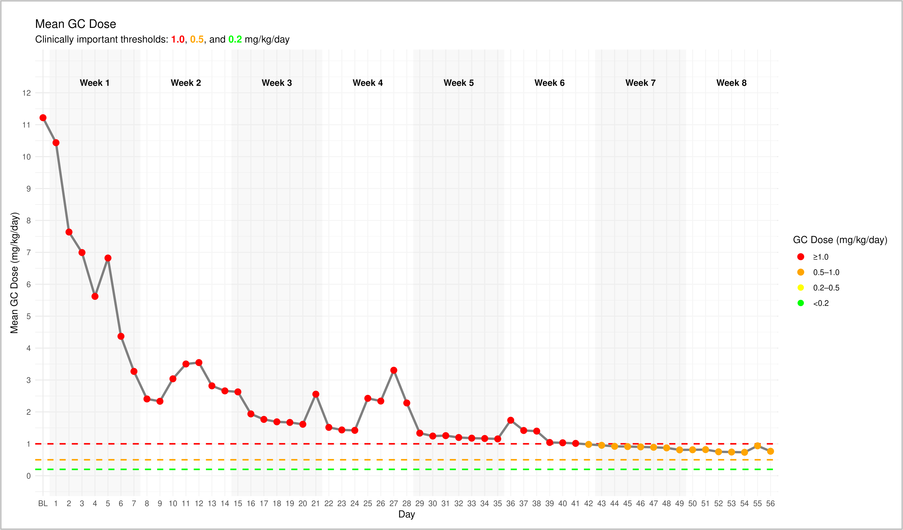
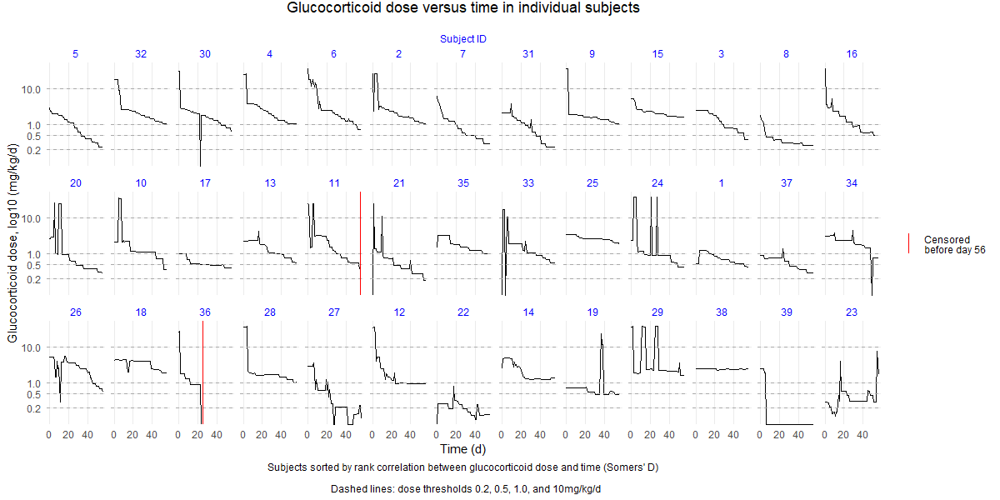
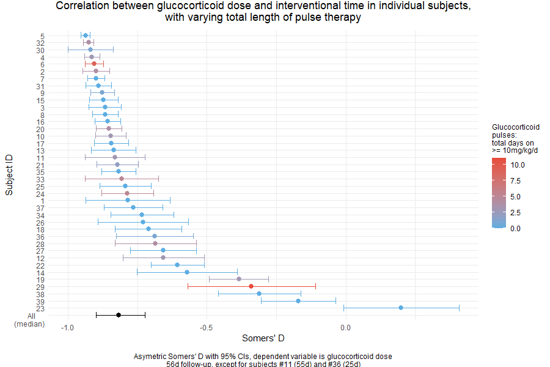
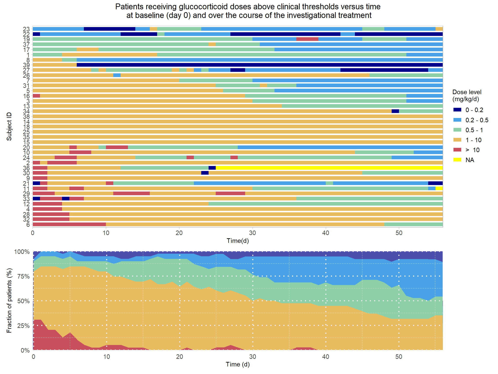
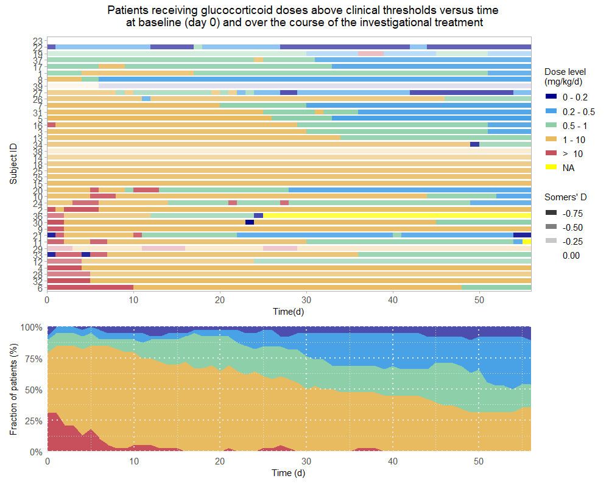
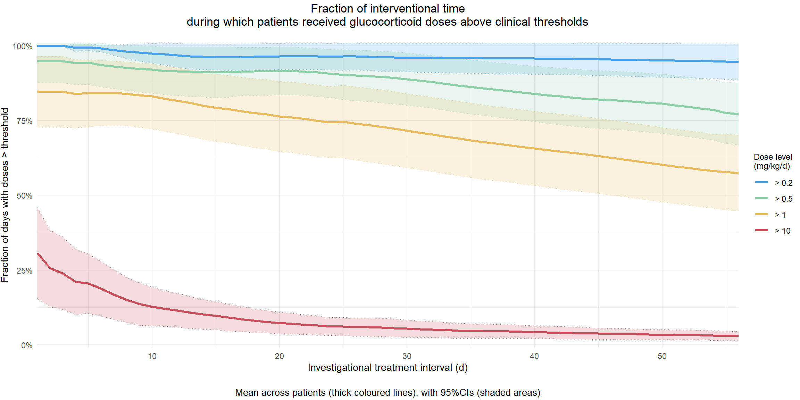
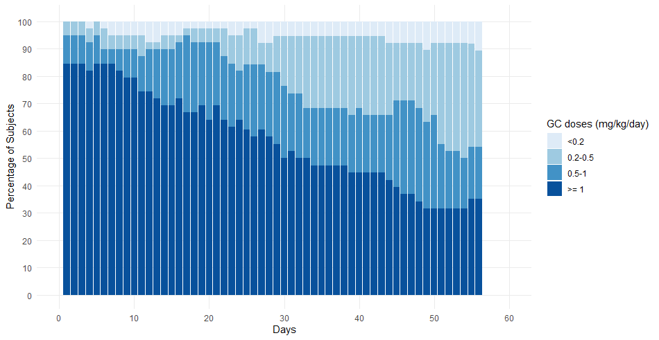
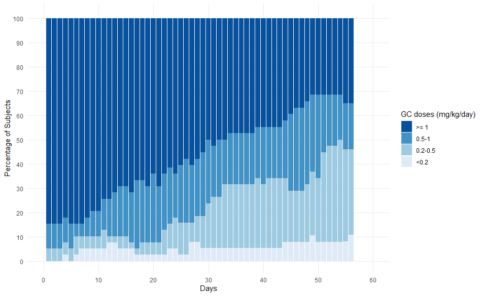
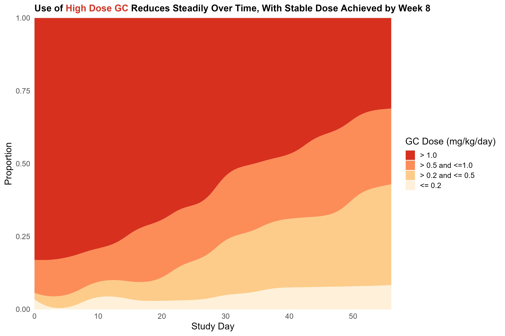
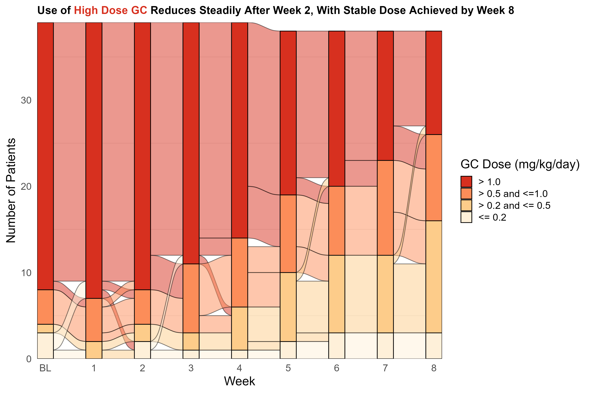

# Macrophage Activation Syndrome

Macrophage activation syndrome (MAS) is a severe, potentially life-threatening condition involving a massive inflammatory response that overwhelms the whole body. It mainly affects children and symptoms include: fever, tiredness, low energy, headaches, confusion, seizures, enlarged lymph nodes, liver and spleen problems and bleeding disorders.

Current standard therapy includes high dose glucocorticoid (GC) treatment, although these have significant side effects including reduced growth rate, cataracts, mood changes and weight gain. Long term exposure to GC causes significant harm, especially in children.

Data set:

The data provided are based on two pooled open-label studies in children (n=39) with a diagnosis of MAS disease currently receiving GC treatment. Enrolled subjects started a new investigational drug on day 1, and one objective of the study was to reduce (taper) the GC dose to a safe level during the 8 week interventional period.

The data include daily GC doses levels for the 56 day interventional period, and also weekly average GC doses (week 1-8).

The Challenge:

- How effective was the new investigational drug in reducing GC doses over 8 weeks?
- Clinically important thresholds are 1.0, 0.5 and 0.2 mg/kg/day:
  - What proportion of subjects achieved GC doses between these levels, and how did this change over time?
  - How much variability was there in GC doses, e.g. characterise shifts between threshold levels at the individual subject level?

A description of the challenge can also be found [here](https://vis-sig.github.io/Wonderful-Wednesdays/data/2025/2025-04-09/).  
A recording of the session can be found [here](https://psiweb.org/vod/item/psi-vissig-wonderful-wednesday-62-macrophage-activation-syndrome).

## Visualisations

The discussion of the various plots includes advantages of double coding, intelligent sorting, choosing time intervals, selecting suitable colour gradients and the level order. The latter one is important for streamgraphs, stacked bar charts and Sankey diagrams.

<a id="example1"></a>

### Example 1. Line graph

  

[link to code](#example1 code)


<a id="example2"></a>

### Example 2. Patient profile graph

The purpose of this plot is getting an initial "feel" for trends and variability in the raw data. 
With only 39 subjects a facet-plot showing dose vs. time for each individual was feasible. Facet were arranged from left to right and top to bottom in order of decreasing strength of correlation (values of the Somer's rank correlation coefficient are shown in the next plot). Because the GC pulses represented extreme outliers, I used log scale to visualise trends, namely in the lower value range. Horizontal lines at 0.2, 0.5 and 1mg/kg/day define the three GC thresholds mentioned in the challenge. Additionally, doses >10mg/kg/day define GC pulses.

  

[link to code](#example2 code)

<a id="example3"></a>

### Example 3. Correlation dot plot

Somers' D is a non-parametric measure of correlation related to Goodman-Kruskal's Gamma and Kendall's Tau-b. In contrast to the latter, the asymmetric Somers' D coefficient is appropriate where of the variables being dependent on the other, as in this case.

  
The correlation coefficients for GC dose vs. time, including their 95% CIs, were negative for all subjects but one. The median Somers’ D across all patients was -0.817 (95% CI: -0.898 - -0.722). Strength of correlation seemed not associated with the total length of time patients received GC pulse therapy, probably because the frequency of the high-dose outliers/pulses decreased over the treatment period. 

[link to code](#example3 code)

<a id="example4"></a>

### Example 4. Lasagna/spaghetti plots

The upper of the two panels is a “spaghetti plot”. This format offers a more compact way to visualise dose changes over time than the faceted line plots above, although at the expense of time-dependent resolution (qualitative changes) and/or clarity (colour instead of height). Subjects on the y-axis are sorted by dose level, consecutively from day 1 to day 56 of the treatment (ignoring baseline values at day 0). This makes the spaghetti plot more similar in appearance and comparable to the stacked area plot in the lower panel, showing changes in the proportion of patients with dose ranges between different threshold levels.

  
As an optional feature, the correlation of dose vs. time in individual subjects can be shown by increasing the transparency of the coloured bars with decreasing negative correlation strength. This could be useful for focussing on subjects where changes from higher to lower thresholds are part of a strong general trend for decreasing dose with treatment time. However, finding a range for the transparency scale that provided satisfactory visual discrimination was not easy with this set of values.

 

[link to code](#example4 code)

<a id="example5"></a>

### Example 5. Line graph with CI

Instead of looking at changes in patient numbers, this figure tries to quantify the days that an average patient might (no longer) need GC doses above certain thresholds. This transformation smoothes the effect of extreme changes, i.e. the GC pulses, while preserving their effect on the variability of the sample. The x-axis represents the accumulated time since start of the investigational treatment, the y-axis the average fraction of days that patients were dosed above individual threshold levels. Confidence intervals illustrate the variability of the patient data, and that the apparent decline in over-the-threshold dosing might not be significant except for the 10mg/kg/day level (GC pulses).
The visualisation could be useful for assessing whether the benefits of treatment are increasing with time, and when the change will become significant for the average patient.

  

[link to code](#example5 code)

<a id="example6"></a>

### Example 6. Stacked bar chart

  
 

[link to code](#example6 code)

### Example 7. Streamgraph

  

[link to code](#example7 code)

### Example 8. Sankey diagram

  

[link to code](#example8 code)

## Code

<a id="example1 code"></a>

### Example 1. Line graph

Oops, some code is missing here. We're working on it.

[Back to blog](#example1)

<a id="example2 code"></a>
<a id="example3 code"></a>
<a id="example4 code"></a>
<a id="example5 code"></a>

### Example 2 - 5

The code and documentation is provided by Thomas Weissensteiner on his [publication page](https://rpubs.com/thomas-weissensteiner/1311031).

[Back to blog example 2 Patient profile graph](#example2) <br>
[Back to blog example 3 Correlation dot plot](#example3) <br>
[Back to blog example 4 Lasagna/spaghetti plots](#example4) <br>
[Back to blog example 5 Line graph with CI](#example5) <br>

<a id="example6 code"></a>

### Example 6. Stacked bar chart

```{r, file = './code/WW_GCdose_APR2025-BarbaraMaas.R', echo = TRUE, eval=FALSE}

```

[Back to blog](#example6)

<a id="example7 code"></a>

### Example 7. Streamgraph

```{r, file = './code/streamgraph_SM-SteveMallett.R', echo = TRUE, eval=FALSE}

```

[Back to blog](#example7)

<a id="example8 code"></a>

### Example 8. Sankey diagram

```{r, file = './code/sankeydiagram_SM-SteveMallett.R', echo = TRUE, eval=FALSE}

```

[Back to blog](#example8)


