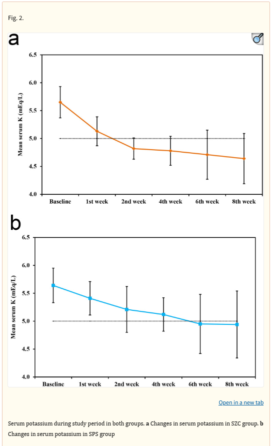
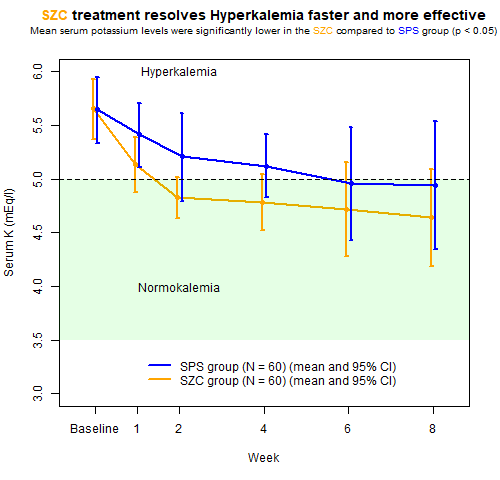
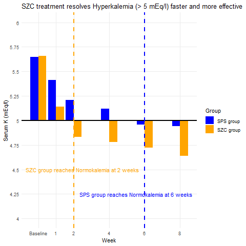
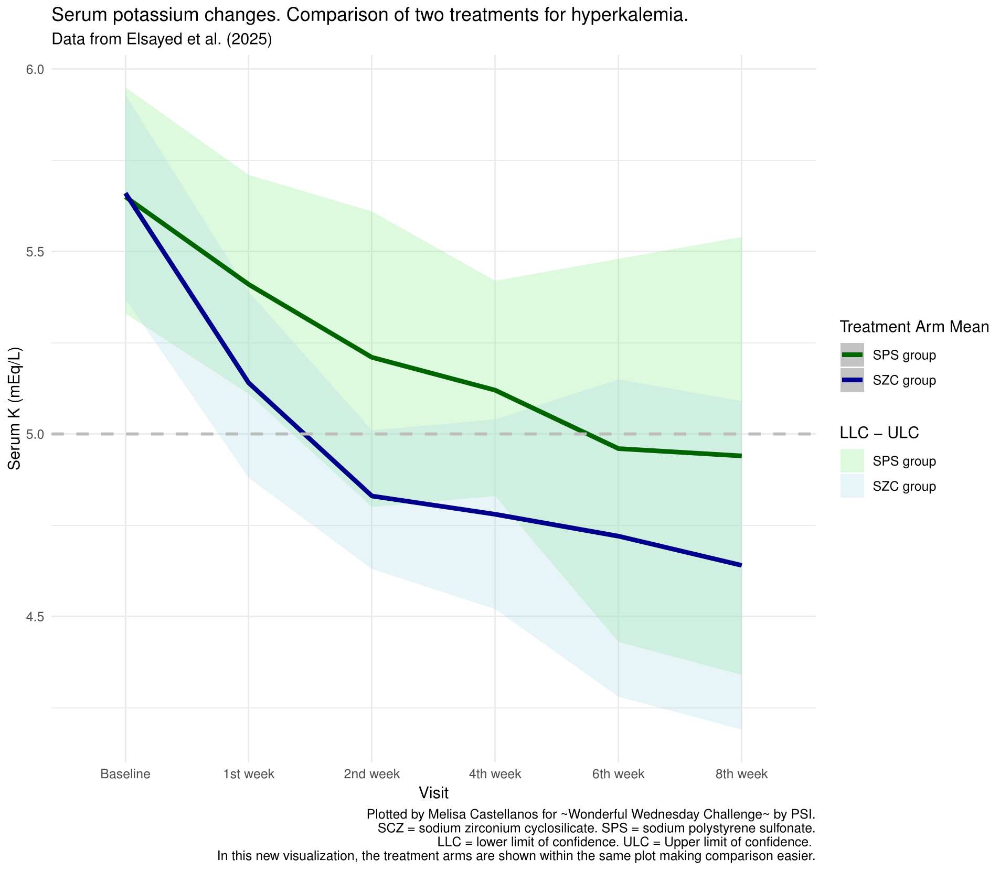

# Hyperkalemia Trial

There was a recently publication of a trial on treatment of patients with hyperkalemia. While the trial outcome was very positive the graphical representation left room for improvement.

Data set:

The [data](https://github.com/VIS-SIG/Wonderful-Wednesdays/blob/master/data/2025/2025-05-14/fig2data.csv) was created by reading out the results shown in the plot of the publication. 

| Variable Name | Variable Label                           |
|---------------|------------------------------------------|
| x             | Original value from the vertical axis    |
| y             | Original value from the horizontal axis  |
| file          | File name of data input                  |
| class         | Original group label                     |
| treat         | Treatment group (derived)                |
| stat          | Statistical measure                      |
|               |   mean: mean value                       |
|               |   llc:  lower limit of confidence        |
|               |   ulc:  upper limit of confidence        |
| visit         | Study visit (derived)                    |
| serumK        | Blood serum level of Potassium (derived) |

The Challenge:

Within the publication the below plot was present. This months challenge is to improve the plot or find a better way to visually present the data.



Reference:

Sodium zirconium cyclosilicate versus sodium polystyrene sulfonate for treatment of hyperkalemia in hemodialysis patients: a randomized clinical trial
The publication is available via [NIH](https://pmc.ncbi.nlm.nih.gov/articles/PMC12054224/) or [BMC Nephrology](https://bmcnephrol.biomedcentral.com/articles/10.1186/s12882-025-04129-9).

A description of the challenge can also be found [here](https://vis-sig.github.io/Wonderful-Wednesdays/data/2025/2025-05-14).  
A recording of the session can be found [here](https://psiweb.org/vod/item/psi-vissig-wonderful-wednesday-63-hyperkalemia-trail).

## Visualisations

<a id="example1"></a>

### Example 1. Line graph

  

[link to code](#example1 code)

<a id="example2"></a>

### Example 2. Bar chart

  

[link to code](#example2 code)

<a id="example3"></a>

### Example 3. Confidence bands

 
[pdf file](./images/Castellanos-Hyperkalemia-challenge-Melisa-Castellanos.pdf)  

[link to code](#example3 code)

## Code

<a id="example1 code"></a>

### Example 1. Line graph

```{r, file = './code/WW_ImproveFigure1_May2025.R', echo = TRUE, eval=FALSE}

```

[Back to blog](#example1)


<a id="example2 code"></a>

### Example 2. Bar chart

```{r, file = './code/WW_ImproveFigure2_May2025.R', echo = TRUE, eval=FALSE}

```

[Back to blog](#example2)


<a id="example3 code"></a>

### Example 3. Confidence bands

```{r, file = './code/Hyperk-challenge-MelisaCastellanos.R', echo = TRUE, eval=FALSE}

```

[Back to blog](#example3)


