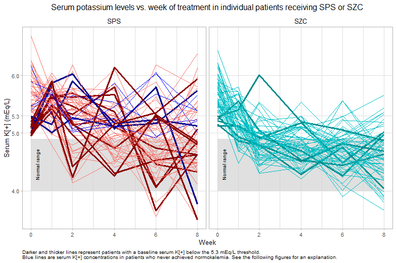
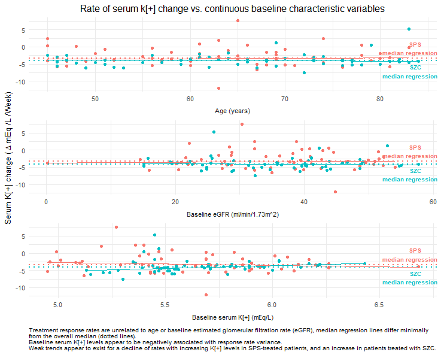
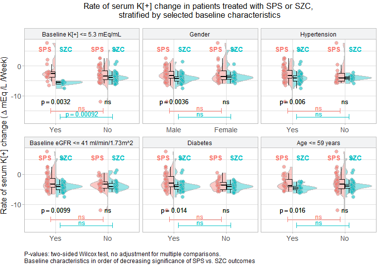
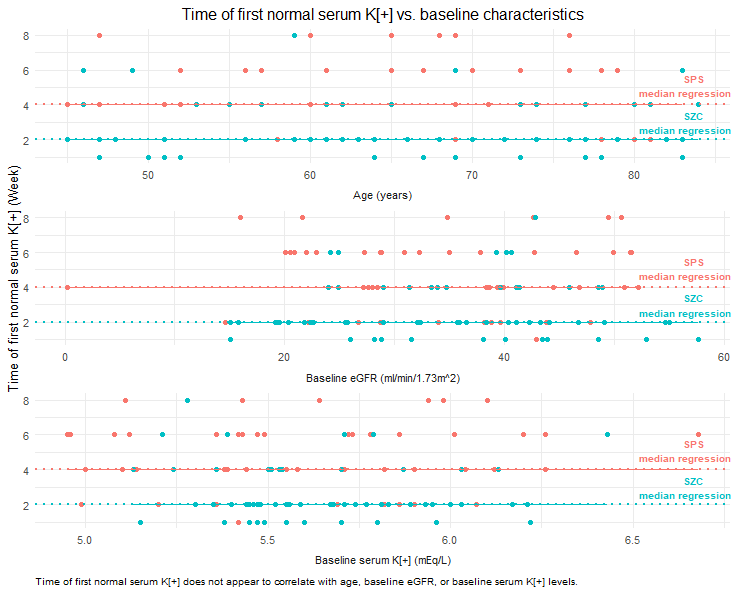
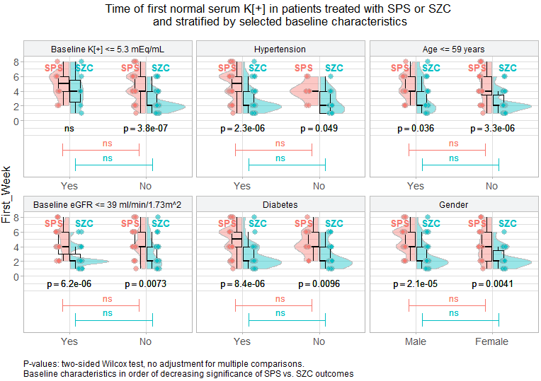
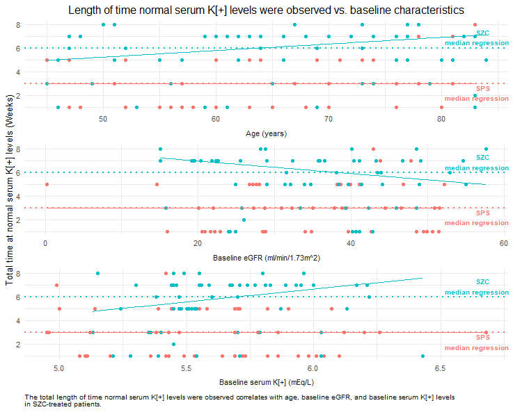
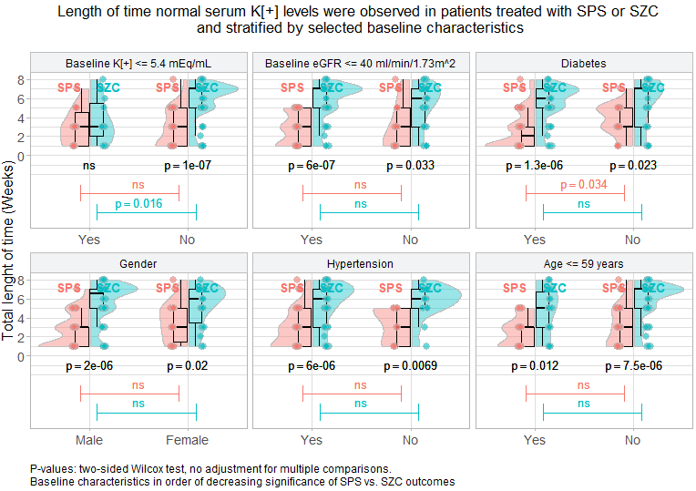
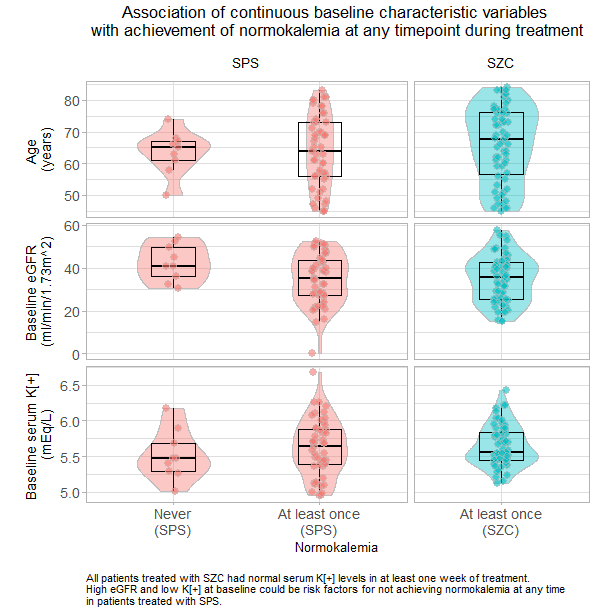
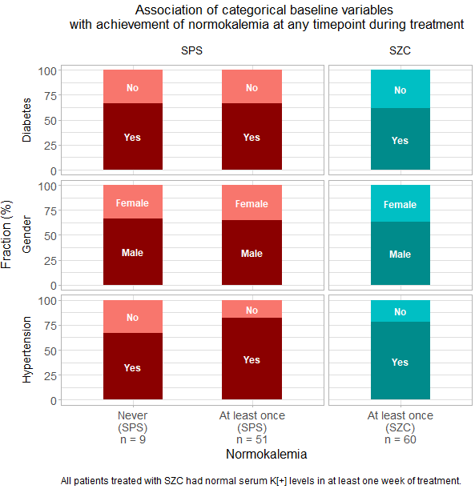

# Hyperkalemia Trial Data

There was a recently publication of a trial on treatment of patients with hyperkalemia. While the challenge in June was the improvement of the original plot the focus is now on the individual data.

Data set:

The [data](https://github.com/VIS-SIG/Wonderful-Wednesdays/blob/master/data/2025/2025-05-14/fig2data.csv) was created using AI-generated [code](https://github.com/VIS-SIG/Wonderful-Wednesdays/blob/master/data/2025/2025-06-11/wwwMay.py) matching the results shown in the plot of the publication. This [prompt](https://github.com/VIS-SIG/Wonderful-Wednesdays/blob/master/data/2025/2025-06-11/AI_history.txt) was used with Claude 4. 

The Challenge:

This months challenge is a follow-up from last month. Generate a plot that includes patient level data information or distribution information.

Reference:

Sodium zirconium cyclosilicate versus sodium polystyrene sulfonate for treatment of hyperkalemia in hemodialysis patients: a randomized clinical trial
The publication is available via [NIH](https://pmc.ncbi.nlm.nih.gov/articles/PMC12054224/) or [BMC Nephrology](https://bmcnephrol.biomedcentral.com/articles/10.1186/s12882-025-04129-9).

A description of the challenge can also be found [here](https://github.com/VIS-SIG/Wonderful-Wednesdays/tree/master/data/2025/2025-06-11).  
A recording of the session can be found [here](https://psiweb.org/vod/item/psi-vissig-wonderful-wednesday-64-hyperkalemia-trail-continued).

## Visualisations

Several visualisations are presented, where each is forming a part of a wider submission. This highlights how a series of data visualisations can be used to investigate and identify key relationships in the data, and then to subsequently highlight these key relationships when communicating findings.

The complete story from Thomas Weissensteiner can be found on his [publication page](https://rpubs.com/thomas-weissensteiner/1334093).

### Example 1. 

 

[link to code](#example1 code)

### Example 2. 

 

[link to code](#example2 code)

### Example 3. 

 

[link to code](#example3 code)

### Example 4. 

 

[link to code](#example4 code)

### Example 5. 

 

[link to code](#example5 code)

### Example 6. 

 

[link to code](#example6 code)

### Example 7. 

[link to code](#example7 code)

### Example 8. 

[link to code](#example8 code)

### Example 9. 

 

[link to code](#example9 code)

## Code

### Example 1 to 9. 

The code and documentation is provided by Thomas Weissensteiner on his [publication page](https://rpubs.com/thomas-weissensteiner/1334093)

