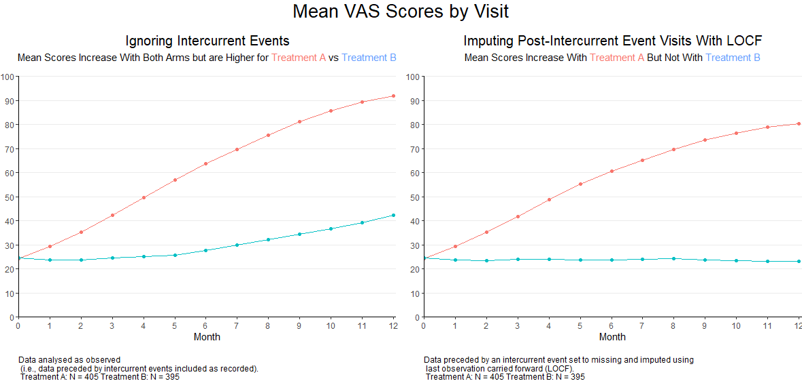
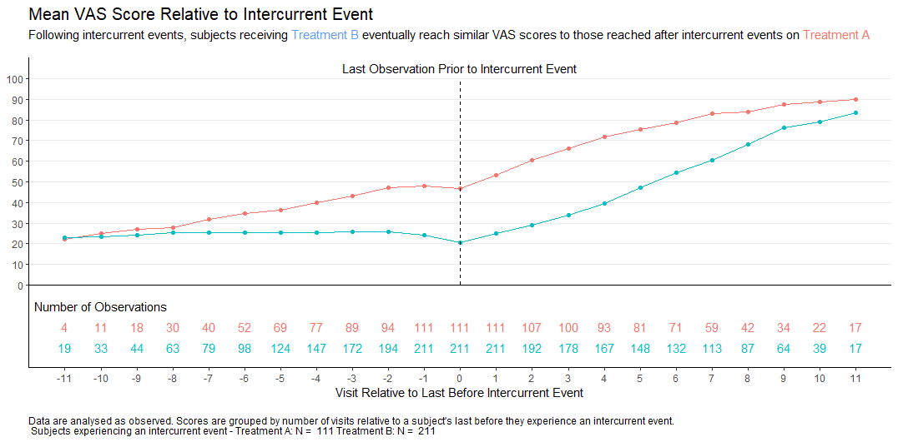

# Intercurrent events

The Background:

Intercurrent event: event occurring after initiation of study intervention which either precludes the observation of the outcome variable or affects its measurement or interpretation.

Data set:

- 800 subjects randomised 1:1 to Treatment A or Treatment B
- Patients respond to a visual analogue scale (0=worst outcome, 100=best outcome) monthly for one year
- Variables: (1) USUBJID (2) TRT (3) AVISIT (4) AVAL (5) ICE
  - ICE is an indicator variable (Y or N), reflecting whether the visit is preceeded by an intercurrent event

The Challenge:

Compare the two treatment arms, considering how intercurrent events might be handled.

A description of the challenge can also be found [here](https://github.com/VIS-SIG/Wonderful-Wednesdays/tree/master/data/2025/2025-07-09).  
A recording of the session can be found [here](https://psiweb.org/vod/item/psi-vissig-wonderful-wednesday-65-intercurrent-events).

<a id="example1"></a>

## Example 1. Faceted line plot

  

[pdf file](./images/lsm_panel-Steve-Mallett.pdf)  


[link to code](#example1 code)


<a id="example2"></a>

## Example 2. Visualization side by side

  

[link to code](#example2 code)

<a id="example3"></a>

## Example 3. Using individual anker point

  
[link to code](#example3 code)

# Code

<a id="example1 code"></a>

## Example 1. Faceted line plot

```{r, echo = TRUE, eval=FALSE, code = readLines("./code/lsm_lineplot-Steve-Mallett.R")}

```

[Back to blog](#example1)


<a id="example2 code"></a>

## Example 2. Visualization side by side

```{r, file = './code/rhys2.R', echo = TRUE, eval=FALSE}

```


[Back to blog](#example2)


<a id="example3 code"></a>

## Example 3. Using individual anker point

```{r, file = './code/rhys3.R', echo = TRUE, eval=FALSE}

```

[Back to blog](#example3)

