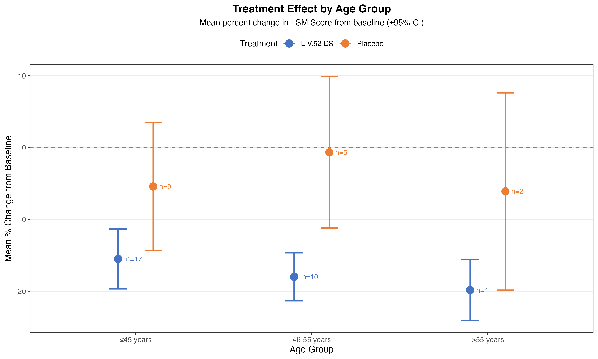

# Fatty liver disease subgroups

The Background:

There is a recent publication: The Effect of Liv.52 DS in Metabolic Dysfunction-Associated Fatty Liver Disease (MAFLD): A Pilot, Randomized, Double-Blind, Placebo-Controlled, Clinical Study

The publication is available via [NIH](https://pubmed.ncbi.nlm.nih.gov/40765845/).

In this publication a pair of figures has been attached, that is the basis of the discussion on graphic design principles.

Data set:

The [data](https://vis-sig.github.io/Wonderful-Wednesdays/data/2025/2025-08-13/LSM_Score.csv) is derived to match the plotted results in the publication. Some baseline characteristics are simulated for the purpose of the challenge.

| Variable Name | Variable Label                           |
|---------------|------------------------------------------|
| Group         | Treatment group                          |
| Baseline_kPa  | Baseline value of the LSM Score          |
| EOS_kPa       | End of study value of the LSM Score      |
| Sex           | Sex (male/female)                        |
| Steatosis     | Course of steatosis                      |
| Age           | Age at baseline in years                 |
| Weight        | Baseline weight in kg                    |


The Challenge:

Create visualisation to explore possible differences in the treatment effect with regard to subgroups.


A description of the challenge can also be found [here](https://vis-sig.github.io/Wonderful-Wednesdays/data/2025/2025-09-10/).  
A recording of the session can be found [here](https://psiweb.org/vod/item/psi-vissig-wonderful-wednesday-67-fatty-liver-disease).

## Visualisation

<a id="example1"></a>

### Prediction model

  
[link to code](#example1 code)

<a id="example2"></a>

### Forest plot

  

### Effect by certain subgroup defining factors





[link to code](#example2 code)

<a id="example3"></a>

### Slope charts

  


## Code

<a id="example1 code"></a>

### Prediction model


```{r, echo = TRUE, eval=FALSE, code = readLines("./code/WW_Oct2025_SM.R")}

```

[Back to blog](#example1)

<a id="example2 code"></a>

### Subgroup plots


```{r, echo = TRUE, eval=FALSE, code = readLines("./code/viz202509.R")}

```

[Back to blog](#example2)


