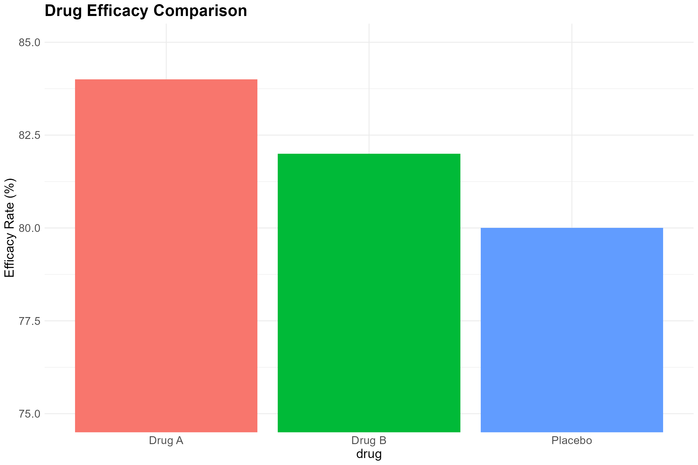
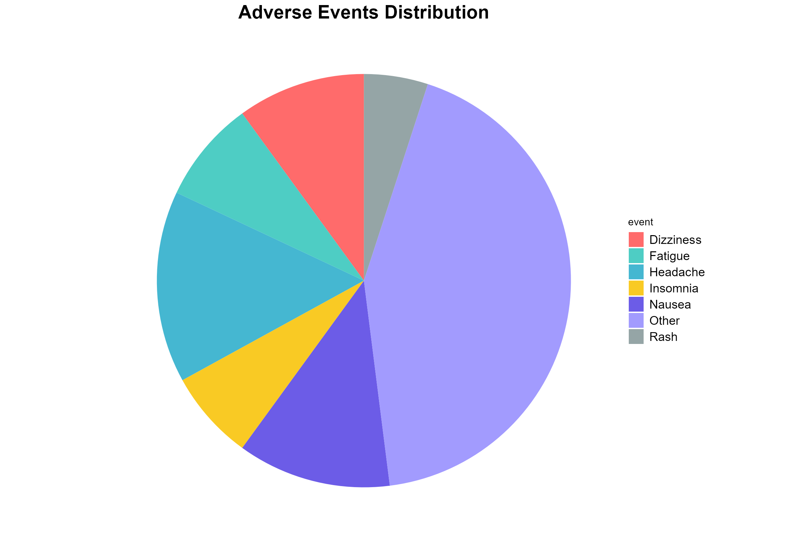
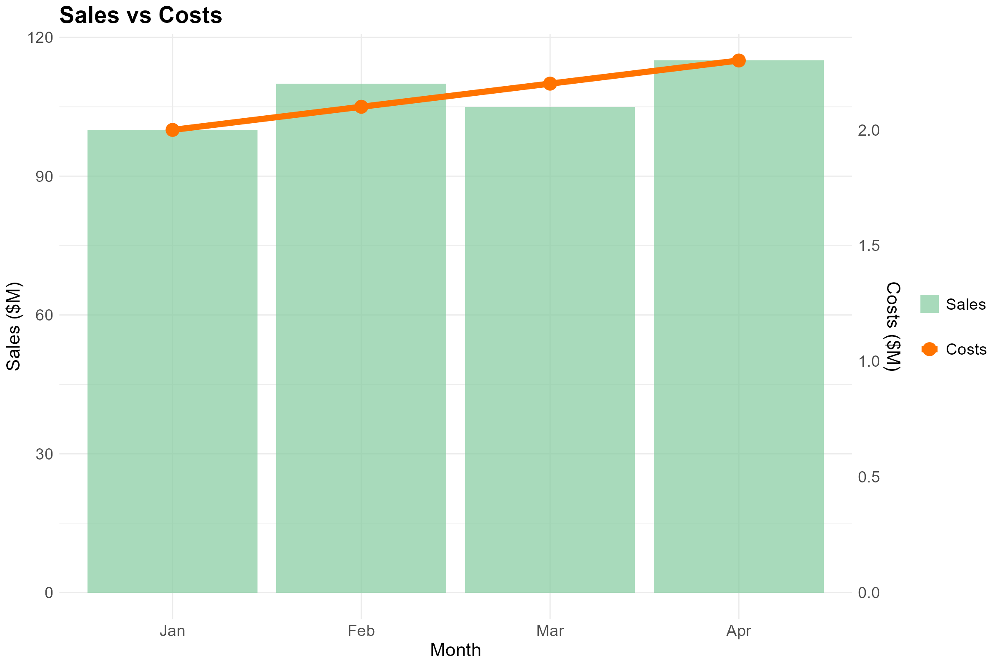
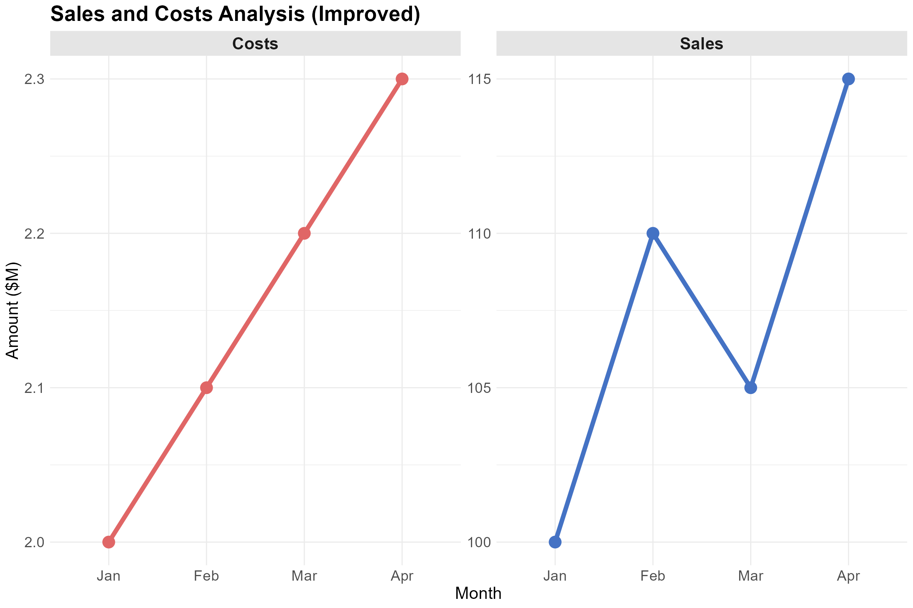
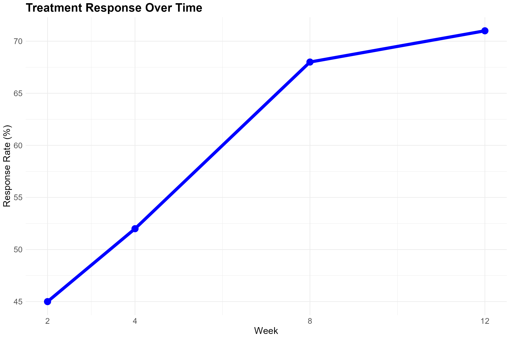
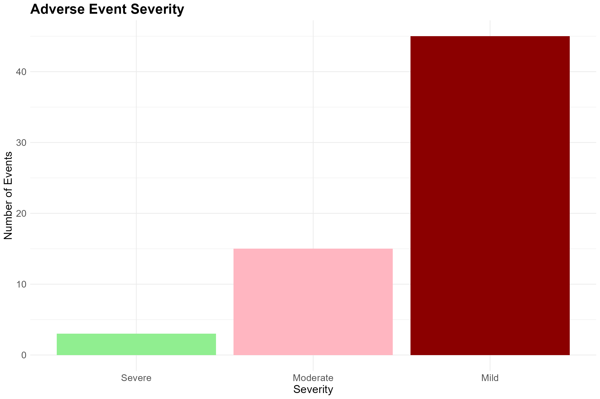
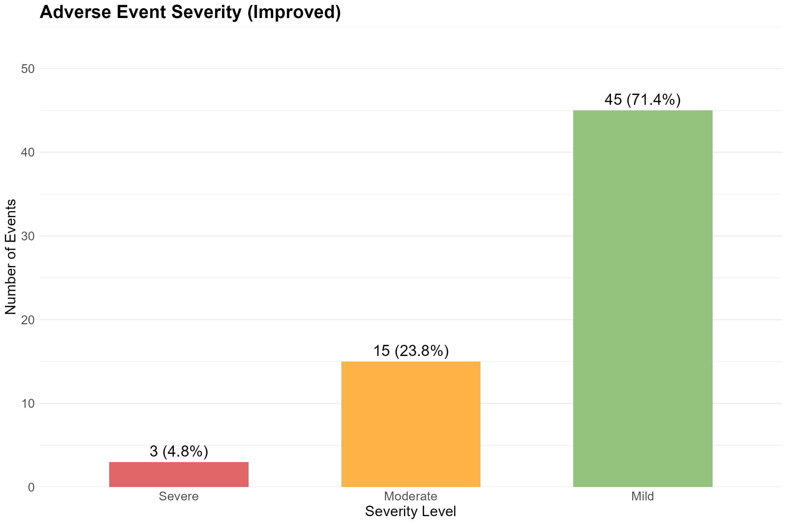

```{r setup, include=FALSE}
knitr::opts_chunk$set(echo = FALSE, warning = FALSE, message = FALSE, fig.align = "center")
library(ggplot2)
library(gridExtra)
library(scales)
library(dplyr)
```

```{css}
body {
  margin: 0;
  padding: 0;
  font-family: -apple-system, BlinkMacSystemFont, "Segoe UI", Roboto, "Helvetica Neue", Arial, sans-serif;
  background: #f8f9fa;
  font-size: 18px;
}

.header {
  text-align: center;
  padding: 60px 20px;
  background: linear-gradient(135deg, #667eea 0%, #764ba2 100%);
  color: white;
}

.header h1 {
  margin: 0;
  font-size: 3em;
  font-weight: 700;
}

.header p {
  margin: 10px 0 0 0;
  font-size: 1.4em;
  opacity: 0.9;
}

.intro {
  max-width: 900px;
  margin: 60px auto;
  padding: 0 30px;
  font-size: 1.2em;
  line-height: 1.7;
  color: #333;
}

.scrolly {
  position: relative;
  display: flex;
  padding: 0;
  margin: 60px 0;
}

.sticky-thing {
  position: -webkit-sticky;
  position: sticky;
  top: 0;
  width: 55%;
  height: 100vh;
  display: flex;
  align-items: center;
  justify-content: center;
  background: #fff;
  flex-shrink: 0;
}

.chart-container {
  position: relative;
  width: 100%;
  max-width: 100%;
  height: 90vh;
  display: flex;
  align-items: center;
  justify-content: center;
}

.chart-side {
  position: absolute;
  top: 50%;
  left: 50%;
  transform: translate(-50%, -50%);
  display: flex;
  flex-direction: column;
  align-items: center;
  justify-content: center;
  opacity: 0;
  transition: opacity 0.6s ease;
  width: 92%;
  max-width: 900px;
}

.chart-side.active {
  opacity: 1;
}

.chart-side img {
  width: 100%;
  height: auto;
  border-radius: 8px;
  box-shadow: 0 8px 16px rgba(0,0,0,0.15);
}

.chart-label {
  margin-top: 20px;
  padding: 10px 20px;
  border-radius: 25px;
  font-weight: 600;
  font-size: 1em;
  text-transform: uppercase;
  letter-spacing: 0.5px;
}

.bad-label {
  background: #fee;
  color: #c33;
}

.good-label {
  background: #efe;
  color: #3c3;
}

.scrolly-overlay {
  position: relative;
  width: 45%;
  padding: 0 50px;
}

.step {
  position: relative;
  padding: 35vh 0;
  margin: 0;
}

.step-content {
  background: white;
  padding: 35px 40px;
  border-radius: 12px;
  box-shadow: 0 10px 30px rgba(0,0,0,0.15);
  border-left: 5px solid #667eea;
  max-width: 100%;
}

.step-content h3 {
  margin-top: 0;
  color: #667eea;
  font-size: 1.6em;
}

.step-content p {
  line-height: 1.7;
  color: #555;
  margin: 12px 0;
  font-size: 1em;
}

.step-content ul {
  line-height: 1.9;
  color: #555;
  font-size: 1em;
}

.step-content .problem {
  background: #fff5f5;
  border-left: 4px solid #e53e3e;
  padding: 18px;
  margin: 18px 0;
  border-radius: 6px;
}

.step-content .improvement {
  background: #f0fff4;
  border-left: 4px solid #38a169;
  padding: 18px;
  margin: 18px 0;
  border-radius: 6px;
}

.spacer {
  height: 40vh;
}

.summary {
  max-width: 900px;
  margin: 80px auto;
  padding: 50px;
  background: white;
  border-radius: 12px;
  box-shadow: 0 4px 6px rgba(0,0,0,0.1);
}

.summary h2 {
  color: #667eea;
  margin-top: 0;
  font-size: 2em;
}

.summary p {
  font-size: 1.1em;
  line-height: 1.7;
}

.summary ul {
  line-height: 1.9;
  font-size: 1.05em;
}

.summary ol {
  line-height: 1.9;
  font-size: 1.05em;
}

@media (max-width: 1024px) {
  .scrolly {
    flex-direction: column;
  }

  .sticky-thing {
    position: relative;
    width: 100%;
    height: 60vh;
  }

  .scrolly-overlay {
    width: 100%;
    padding: 20px;
  }

  .step {
    padding: 30vh 0;
  }
}
```

```{=html}
<div class="header">
<h1>Bad Visualizations Challenge</h1>
<p>Scroll to explore common visualization pitfalls and their solutions</p>
</div>

<div class="intro">
<p><strong>Welcome to the visualization challenge!</strong> This interactive story walks through 5 common mistakes in pharmaceutical data visualization. As you scroll, you'll see problematic charts on the left, understand what's wrong, and discover improved versions on the right.</p>
<p>Each challenge demonstrates real-world visualization pitfalls that can mislead decision-makers. Let's dive in...</p>
</div>
```

```{r generate-charts, include=FALSE}
# Generate all charts and save them

# Challenge 1
efficacy_data <- data.frame(
  drug = c("Drug A", "Drug B", "Placebo"),
  efficacy = c(84, 82, 80)
)

p1_bad <- ggplot(efficacy_data, aes(x = drug, y = efficacy, fill = drug)) +
  geom_bar(stat = "identity") +
  coord_cartesian(ylim = c(75, 85)) +
  labs(title = "Drug Efficacy Comparison", y = "Efficacy Rate (%)") +
  theme_minimal() +
  theme(legend.position = "none", plot.title = element_text(face = "bold", size = 20),
        axis.title = element_text(size = 16), axis.text = element_text(size = 14))

ggsave("chart1_bad.png", p1_bad, width = 12, height = 8, dpi = 200, bg = "white")

p1_good <- ggplot(efficacy_data, aes(x = drug, y = efficacy, fill = drug)) +
  geom_bar(stat = "identity", width = 0.6) +
  scale_y_continuous(limits = c(0, 100), breaks = seq(0, 100, 20)) +
  geom_text(aes(label = paste0(efficacy, "%")), vjust = -0.5, size = 6) +
  scale_fill_manual(values = c("Drug A" = "#4472C4", "Drug B" = "#70AD47", "Placebo" = "#FFC000")) +
  labs(title = "Drug Efficacy Comparison (Improved)", y = "Efficacy Rate (%)", x = "") +
  theme_minimal() +
  theme(legend.position = "none", plot.title = element_text(face = "bold", size = 20),
        panel.grid.major.x = element_blank(), axis.title = element_text(size = 16),
        axis.text = element_text(size = 14))

ggsave("chart1_good.png", p1_good, width = 12, height = 8, dpi = 200, bg = "white")

# Challenge 2
adverse_events <- data.frame(
  event = c("Headache", "Nausea", "Dizziness", "Fatigue", "Insomnia", "Rash", "Other"),
  percentage = c(15, 12, 10, 8, 7, 5, 43)
)

pie_colors <- c("#FF6B6B", "#4ECDC4", "#45B7D1", "#F9CA24", "#6C5CE7", "#A29BFE", "#95A5A6")

p2_bad <- ggplot(adverse_events, aes(x = "", y = percentage, fill = event)) +
  geom_bar(stat = "identity", width = 1) +
  coord_polar("y", start = 0) +
  scale_fill_manual(values = pie_colors) +
  labs(title = "Adverse Events Distribution") +
  theme_void() +
  theme(plot.title = element_text(face = "bold", size = 20, hjust = 0.5),
        legend.position = "right", legend.text = element_text(size = 13))

ggsave("chart2_bad.png", p2_bad, width = 12, height = 8, dpi = 200, bg = "white")

adverse_events_sorted <- adverse_events %>%
  arrange(desc(percentage)) %>%
  mutate(event = factor(event, levels = event))

p2_good <- ggplot(adverse_events_sorted, aes(x = reorder(event, percentage), y = percentage)) +
  geom_col(fill = "#4472C4", width = 0.7) +
  geom_text(aes(label = paste0(percentage, "%")), hjust = -0.2, size = 5.5) +
  coord_flip() +
  scale_y_continuous(limits = c(0, 50), breaks = seq(0, 50, 10), expand = expansion(mult = c(0, 0.1))) +
  labs(title = "Adverse Events Distribution (Improved)", x = "", y = "Percentage (%)") +
  theme_minimal() +
  theme(plot.title = element_text(face = "bold", size = 20),
        panel.grid.major.y = element_blank(), axis.text = element_text(size = 14),
        axis.title = element_text(size = 16))

ggsave("chart2_good.png", p2_good, width = 12, height = 8, dpi = 200, bg = "white")

# Challenge 3
sales_data <- data.frame(
  month = factor(c("Jan", "Feb", "Mar", "Apr"), levels = c("Jan", "Feb", "Mar", "Apr")),
  sales = c(100, 110, 105, 115),
  costs = c(2.0, 2.1, 2.2, 2.3)
)

p3_bad <- ggplot(sales_data, aes(x = month)) +
  geom_bar(aes(y = sales, fill = "Sales"), stat = "identity", alpha = 0.7) +
  geom_line(aes(y = costs * 50, group = 1, color = "Costs"), linewidth = 2.5) +
  geom_point(aes(y = costs * 50, color = "Costs"), size = 5) +
  scale_y_continuous(name = "Sales ($M)", sec.axis = sec_axis(~./50, name = "Costs ($M)")) +
  scale_fill_manual(values = c("Sales" = "#82ca9d")) +
  scale_color_manual(values = c("Costs" = "#ff7300")) +
  labs(title = "Sales vs Costs", x = "Month") +
  theme_minimal() +
  theme(plot.title = element_text(face = "bold", size = 20), legend.title = element_blank(),
        legend.text = element_text(size = 14), axis.text = element_text(size = 14),
        axis.title = element_text(size = 16))

ggsave("chart3_bad.png", p3_bad, width = 12, height = 8, dpi = 200, bg = "white")

sales_long <- sales_data %>%
  tidyr::pivot_longer(cols = c(sales, costs), names_to = "metric", values_to = "value") %>%
  mutate(metric = ifelse(metric == "sales", "Sales", "Costs"))

p3_good <- ggplot(sales_long, aes(x = month, y = value, group = metric, color = metric)) +
  geom_line(linewidth = 2) +
  geom_point(size = 5) +
  facet_wrap(~metric, scales = "free_y", ncol = 2) +
  scale_color_manual(values = c("Sales" = "#4472C4", "Costs" = "#E06666")) +
  labs(title = "Sales and Costs Analysis (Improved)", x = "Month", y = "Amount ($M)") +
  theme_minimal() +
  theme(plot.title = element_text(face = "bold", size = 20), legend.position = "none",
        strip.text = element_text(face = "bold", size = 16), strip.background = element_rect(fill = "gray90", color = NA),
        axis.text = element_text(size = 14), axis.title = element_text(size = 16))

ggsave("chart3_good.png", p3_good, width = 12, height = 8, dpi = 200, bg = "white")

# Challenge 4
trial_data <- data.frame(
  week = 1:12,
  response = c(40, 45, 44, 52, 50, 48, 55, 68, 65, 66, 69, 71),
  se = c(3, 3, 2.5, 3, 2.8, 3.2, 2.9, 2.7, 2.8, 2.6, 2.5, 2.4)
)

p4_bad <- ggplot(trial_data %>% filter(week %in% c(2, 4, 8, 12)), aes(x = week, y = response)) +
  geom_line(color = "blue", linewidth = 2.5) +
  geom_point(color = "blue", size = 5) +
  scale_x_continuous(breaks = c(2, 4, 8, 12)) +
  labs(title = "Treatment Response Over Time", x = "Week", y = "Response Rate (%)") +
  theme_minimal() +
  theme(plot.title = element_text(face = "bold", size = 20),
        axis.text = element_text(size = 14), axis.title = element_text(size = 16))

ggsave("chart4_bad.png", p4_bad, width = 12, height = 8, dpi = 200, bg = "white")

p4_good <- ggplot(trial_data, aes(x = week, y = response)) +
  geom_ribbon(aes(ymin = response - se, ymax = response + se), alpha = 0.2, fill = "#4472C4") +
  geom_line(color = "#4472C4", linewidth = 2) +
  geom_point(color = "#4472C4", size = 4) +
  scale_x_continuous(breaks = 1:12) +
  scale_y_continuous(limits = c(0, 100), breaks = seq(0, 100, 20)) +
  labs(title = "Treatment Response Over Time (Improved)", x = "Week", y = "Response Rate (%)") +
  theme_minimal() +
  theme(plot.title = element_text(face = "bold", size = 20), panel.grid.minor = element_blank(),
        axis.text = element_text(size = 14), axis.title = element_text(size = 16))

ggsave("chart4_good.png", p4_good, width = 12, height = 8, dpi = 200, bg = "white")

# Challenge 5
safety_data <- data.frame(
  category = factor(c("Severe", "Moderate", "Mild"), levels = c("Severe", "Moderate", "Mild")),
  count = c(3, 15, 45)
)

p5_bad <- ggplot(safety_data, aes(x = category, y = count, fill = category)) +
  geom_bar(stat = "identity") +
  scale_fill_manual(values = c("Severe" = "#90EE90", "Moderate" = "#FFB6C1", "Mild" = "#8B0000")) +
  labs(title = "Adverse Event Severity", x = "Severity", y = "Number of Events") +
  theme_minimal() +
  theme(legend.position = "none", plot.title = element_text(face = "bold", size = 20),
        axis.text = element_text(size = 14), axis.title = element_text(size = 16))

ggsave("chart5_bad.png", p5_bad, width = 12, height = 8, dpi = 200, bg = "white")

safety_data_pct <- safety_data %>%
  mutate(percentage = round(count / sum(count) * 100, 1),
         label = paste0(count, " (", percentage, "%)"))

p5_good <- ggplot(safety_data_pct, aes(x = category, y = count, fill = category)) +
  geom_col(width = 0.6) +
  geom_text(aes(label = label), vjust = -0.5, size = 6) +
  scale_fill_manual(values = c("Severe" = "#E06666", "Moderate" = "#FFB347", "Mild" = "#93C47D")) +
  scale_y_continuous(limits = c(0, 50), breaks = seq(0, 50, 10), expand = expansion(mult = c(0, 0.1))) +
  labs(title = "Adverse Event Severity (Improved)", x = "Severity Level", y = "Number of Events") +
  theme_minimal() +
  theme(legend.position = "none", plot.title = element_text(face = "bold", size = 20),
        panel.grid.major.x = element_blank(), axis.text = element_text(size = 14),
        axis.title = element_text(size = 16))

ggsave("chart5_good.png", p5_good, width = 12, height = 8, dpi = 200, bg = "white")
```

```{=html}
<!-- Challenge 1 -->
<section class="scrolly">
  <div class="sticky-thing">
    <div class="chart-container">
      <div class="chart-side" id="chart1-bad">
        
        <span class="chart-label bad-label">Problematic</span>
      </div>
      <div class="chart-side" id="chart1-good">
        
        <span class="chart-label good-label">Improved</span>
      </div>
    </div>
  </div>

  <div class="scrolly-overlay">
    <div class="step" data-step="1" data-chart="chart1-bad">
      <div class="step-content">
        <h3>Challenge 1: Drug Efficacy</h3>
        <p>This chart compares efficacy rates for Drug A, Drug B, and Placebo from a Phase III clinical trial.</p>
        <p>At first glance, Drug A appears dramatically more effective than the others. But is it really?</p>
      </div>
    </div>

    <div class="step" data-step="2" data-chart="chart1-bad">
      <div class="step-content">
        <div class="problem">
          <strong>❌ The Problem:</strong>
          <p>The y-axis is truncated (75-85%), which exaggerates small differences. The actual difference between Drug A (84%) and Placebo (80%) is only 4 percentage points.</p>
        </div>
      </div>
    </div>

    <div class="step" data-step="3" data-chart="chart1-good">
      <div class="step-content">
        <div class="improvement">
          <strong>✓ The Solution:</strong>
          <ul>
            <li>Y-axis starts at 0% for accurate visual comparison</li>
            <li>Added value labels for precise readings</li>
            <li>Consistent, professional color scheme</li>
          </ul>
          <p>Now the true scale of differences is clear.</p>
        </div>
      </div>
    </div>
  </div>
</section>

<div class="spacer"></div>

<!-- Challenge 2 -->
<section class="scrolly">
  <div class="sticky-thing">
    <div class="chart-container">
      <div class="chart-side" id="chart2-bad">
        
        <span class="chart-label bad-label">Problematic</span>
      </div>
      <div class="chart-side" id="chart2-good">
        
        <span class="chart-label good-label">Improved</span>
      </div>
    </div>
  </div>

  <div class="scrolly-overlay">
    <div class="step" data-step="1" data-chart="chart2-bad">
      <div class="step-content">
        <h3>Challenge 2: Adverse Events</h3>
        <p>This pie chart shows the distribution of adverse events in a safety profile analysis.</p>
        <p>Can you quickly tell which specific adverse event is most common (excluding "Other")?</p>
      </div>
    </div>

    <div class="step" data-step="2" data-chart="chart2-bad">
      <div class="step-content">
        <div class="problem">
          <strong>❌ The Problem:</strong>
          <p>Pie charts make it difficult to compare values. The "Other" category dominates, and it's hard to read exact percentages or compare similar-sized slices.</p>
        </div>
      </div>
    </div>

    <div class="step" data-step="3" data-chart="chart2-good">
      <div class="step-content">
        <div class="improvement">
          <strong>✓ The Solution:</strong>
          <ul>
            <li>Horizontal bar chart for easy comparison</li>
            <li>Sorted by frequency (highest to lowest)</li>
            <li>Clear value labels on each bar</li>
            <li>Consistent color for focus</li>
          </ul>
          <p>Now it's immediately clear that Headache (15%) is the most common specific event.</p>
        </div>
      </div>
    </div>
  </div>
</section>

<div class="spacer"></div>

<!-- Challenge 3 -->
<section class="scrolly">
  <div class="sticky-thing">
    <div class="chart-container">
      <div class="chart-side" id="chart3-bad">
        
        <span class="chart-label bad-label">Problematic</span>
      </div>
      <div class="chart-side" id="chart3-good">
        
        <span class="chart-label good-label">Improved</span>
      </div>
    </div>
  </div>

  <div class="scrolly-overlay">
    <div class="step" data-step="1" data-chart="chart3-bad">
      <div class="step-content">
        <h3>Challenge 3: Sales & Costs</h3>
        <p>This chart compares sales revenue and costs over four months.</p>
        <p>Sales and costs appear to be perfectly correlated. Should we be concerned?</p>
      </div>
    </div>

    <div class="step" data-step="2" data-chart="chart3-bad">
      <div class="step-content">
        <div class="problem">
          <strong>❌ The Problem:</strong>
          <p>Dual y-axes with vastly different scales (0-120 vs 0-2.4) create a misleading visual correlation. The costs line has been artificially scaled to match sales visually, obscuring the actual relationship.</p>
        </div>
      </div>
    </div>

    <div class="step" data-step="3" data-chart="chart3-good">
      <div class="step-content">
        <div class="improvement">
          <strong>✓ The Solution:</strong>
          <ul>
            <li>Separate facets with independent scales</li>
            <li>Same chart type (line) for both metrics</li>
            <li>Actual values preserved and clearly labeled</li>
            <li>No misleading visual correlations</li>
          </ul>
          <p>Now we can see each trend accurately without artificial scaling.</p>
        </div>
      </div>
    </div>
  </div>
</section>

<div class="spacer"></div>

<!-- Challenge 4 -->
<section class="scrolly">
  <div class="sticky-thing">
    <div class="chart-container">
      <div class="chart-side" id="chart4-bad">
        
        <span class="chart-label bad-label">Problematic</span>
      </div>
      <div class="chart-side" id="chart4-good">
        
        <span class="chart-label good-label">Improved</span>
      </div>
    </div>
  </div>

  <div class="scrolly-overlay">
    <div class="step" data-step="1" data-chart="chart4-bad">
      <div class="step-content">
        <h3>Challenge 4: Treatment Response</h3>
        <p>This chart shows treatment response rates over a 12-week clinical trial.</p>
        <p>The response appears to increase steadily and linearly. Is this the full story?</p>
      </div>
    </div>

    <div class="step" data-step="2" data-chart="chart4-bad">
      <div class="step-content">
        <div class="problem">
          <strong>❌ The Problem:</strong>
          <p>Only 4 of 12 timepoints are shown (weeks 2, 4, 8, 12), cherry-picking data to create a false linear trend. Missing uncertainty estimates and intermediate measurements hide important variation.</p>
        </div>
      </div>
    </div>

    <div class="step" data-step="3" data-chart="chart4-good">
      <div class="step-content">
        <div class="improvement">
          <strong>✓ The Solution:</strong>
          <ul>
            <li>All 12 weekly measurements shown</li>
            <li>Standard error bands indicate uncertainty</li>
            <li>Reveals actual trend with plateaus and fluctuations</li>
            <li>Y-axis starts at 0% for proper context</li>
          </ul>
          <p>The complete data tells a more nuanced story with week-to-week variation.</p>
        </div>
      </div>
    </div>
  </div>
</section>

<div class="spacer"></div>

<!-- Challenge 5 -->
<section class="scrolly">
  <div class="sticky-thing">
    <div class="chart-container">
      <div class="chart-side" id="chart5-bad">
        
        <span class="chart-label bad-label">Problematic</span>
      </div>
      <div class="chart-side" id="chart5-good">
        
        <span class="chart-label good-label">Improved</span>
      </div>
    </div>
  </div>

  <div class="scrolly-overlay">
    <div class="step" data-step="1" data-chart="chart5-bad">
      <div class="step-content">
        <h3>Challenge 5: Event Severity</h3>
        <p>This chart shows adverse event severity distribution from a safety monitoring report.</p>
        <p>Something looks... off. What jumps out at you?</p>
      </div>
    </div>

    <div class="step" data-step="2" data-chart="chart5-bad">
      <div class="step-content">
        <div class="problem">
          <strong>❌ The Problem:</strong>
          <p>Colors are inverted! Severe events are shown in light green (associated with "safe"), while mild events are in dark red (associated with "danger"). This creates dangerous cognitive dissonance.</p>
        </div>
      </div>
    </div>

    <div class="step" data-step="3" data-chart="chart5-good">
      <div class="step-content">
        <div class="improvement">
          <strong>✓ The Solution:</strong>
          <ul>
            <li>Semantically appropriate colors (red = severe, green = mild)</li>
            <li>Added count and percentage labels</li>
            <li>Improved context with total event count</li>
            <li>Colors now support understanding rather than confuse</li>
          </ul>
          <p>Intuitive color coding aligns with universal safety conventions.</p>
        </div>
      </div>
    </div>
  </div>
</section>

<div class="spacer"></div>

<div class="summary">
<h2>Key Takeaways</h2>
<p>These five challenges demonstrate common visualization pitfalls in pharmaceutical data presentation:</p>
<ol>
<li><strong>Truncated Y-axis:</strong> Always start bar charts at zero to avoid exaggerating differences</li>
<li><strong>Pie Charts:</strong> Use bar charts for easier quantitative comparison; sort by frequency</li>
<li><strong>Dual Y-axes:</strong> Avoid misleading correlations by using separate facets with independent scales</li>
<li><strong>Cherry-picked Data:</strong> Show all available data points and include uncertainty measures</li>
<li><strong>Inappropriate Colors:</strong> Use semantically meaningful colors aligned with severity/risk levels</li>
</ol>
<p><strong>Remember:</strong> Visualizations should inform, not mislead. Context and uncertainty are essential. Colors should support understanding, not confuse. Complete data presentation builds trust.</p>
</div>

<script src="https://unpkg.com/scrollama"></script>
<script>
// Setup scrollama
const scroller = scrollama();

scroller
  .setup({
    step: '.step',
    offset: 0.5,
    debug: false
  })
  .onStepEnter(response => {
    const { element } = response;
    const chartId = element.getAttribute('data-chart');

    // Hide all charts in the same section first
    const section = element.closest('.scrolly');
    section.querySelectorAll('.chart-side').forEach(chart => {
      chart.classList.remove('active');
    });

    // Show the specified chart
    const targetChart = section.querySelector(`#${chartId}`);
    if (targetChart) {
      targetChart.classList.add('active');
    }
  });

// Handle window resizes
window.addEventListener('resize', scroller.resize);
</script>
```
