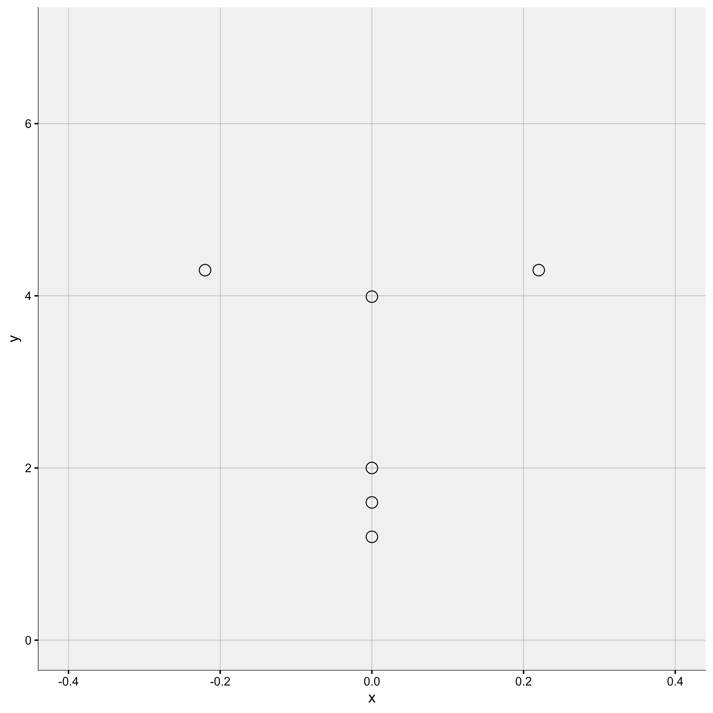
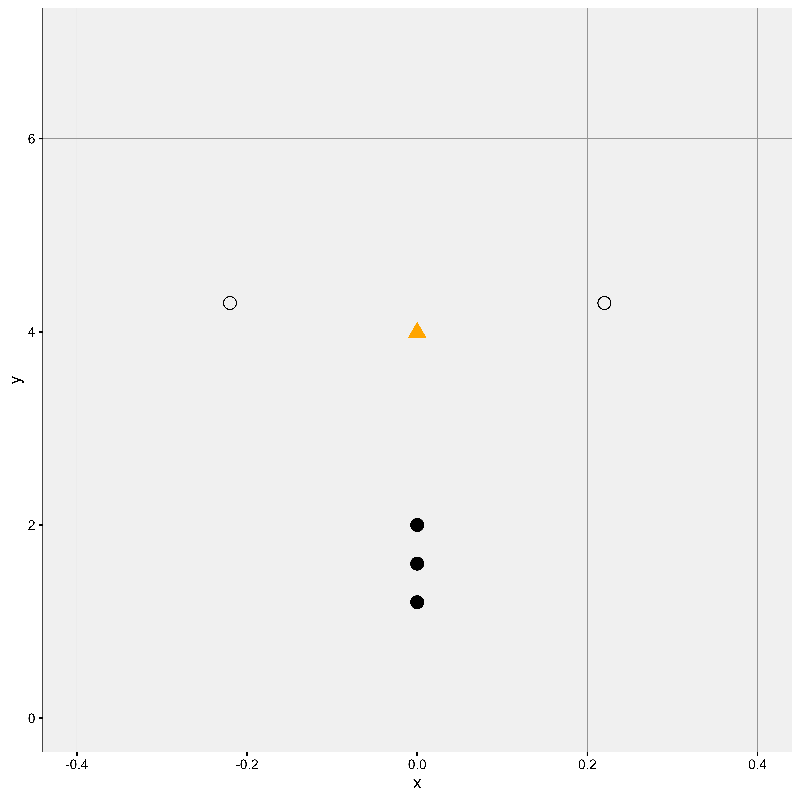
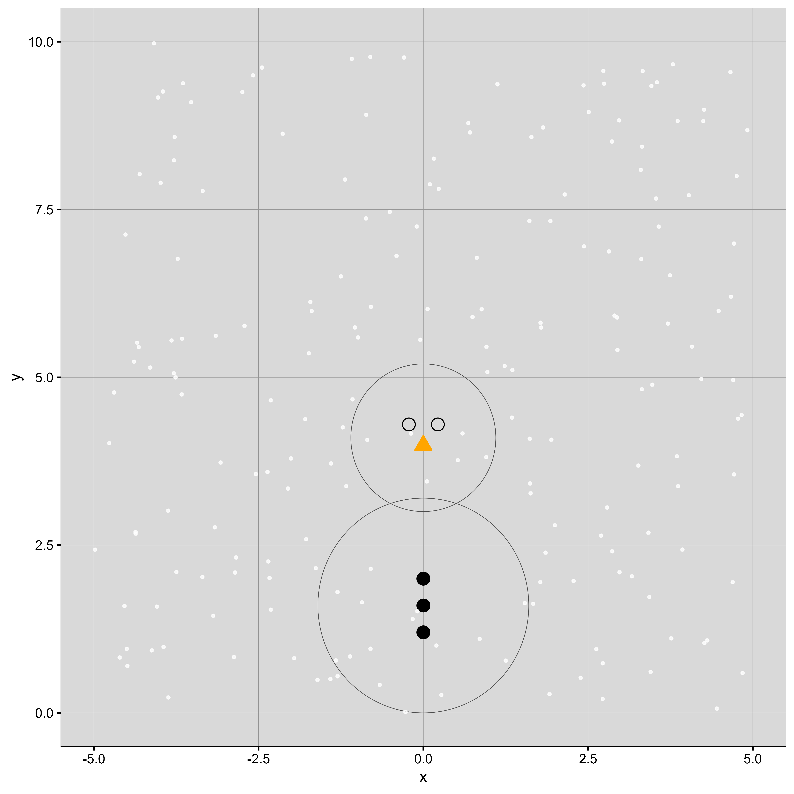
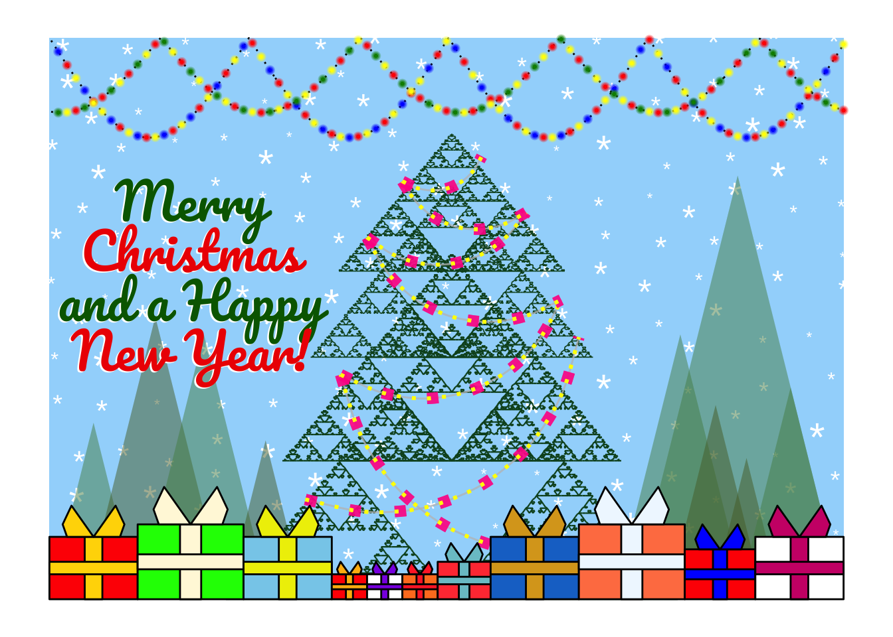

# Seasonal plots

Time for something different! Can you create a seasonally-themed image?

The Challenge:

* It could be a winter scene or have a Christmas/Hanukkah theme
* Use the concept of layers (e.g. ggplot2) to build an image
* Can be static or animated
* Can use AI tools (e.g. Claude/ChatGPT) to develop code using a series of prompts


A description of the challenge can also be found [here](https://vis-sig.github.io/Wonderful-Wednesdays/data/2025/2025-11-12/).  
A recording of the session can be found [here](https://psiweb.org/vod/item/psi-vissig-wonderful-wednesday-69-seasonal-plot).

## Visualisation

<a id="example1"></a>

### Step by step to a snowman

  

[link to code](#example1 code)

<a id="example2"></a>

  

[link to code](#example2 code)

<a id="example3"></a>

  

[link to code](#example3 code)

<a id="example4"></a>

  

[link to code](#example4 code)

<a id="example5"></a>

  

[link to code](#example5 code)

<a id="example6"></a>

  

[link to code](#example6 code)

<a id="example7"></a>

  

[link to code](#example7 code)

<a id="example8"></a>

### Christmas customs

  

[interactive version](https://thomas-weissensteiner.github.io/github.io/CKG.html)

[usage instructions](README_christmas-knowledge-graph_improved-Thomas_Weissensteiner.html)

[link to prompt](#example8 code)

<a id="example9"></a>

### Festive plot generator

  

[link to code](#example9 code)

<a id="example10"></a>

### Christmas scene

  

[link to story and code](Christmas-Viktoriia_Fursenko.html)


## Code

<a id="example1 code"></a>

### step 1 to snowman

```{r, echo = TRUE, eval=FALSE, code = readLines("./code/snowman00.R")}

```

[Back to blog](#example1)

<a id="example2 code"></a>

### step 2 to snowman

```{r, echo = TRUE, eval=FALSE, code = readLines("./code/snowman01.R")}

```

[Back to blog](#example2)

<a id="example3 code"></a>

### step 3 to snowman

```{r, echo = TRUE, eval=FALSE, code = readLines("./code/snowman02.R")}

```

[Back to blog](#example3)

<a id="example4 code"></a>

### step 4 to snowman

```{r, echo = TRUE, eval=FALSE, code = readLines("./code/snowman03.R")}

```

[Back to blog](#example4)

<a id="example5 code"></a>

### step 5 to snowman

```{r, echo = TRUE, eval=FALSE, code = readLines("./code/snowman04.R")}

```

[Back to blog](#example5)

<a id="example6 code"></a>

### step 6 to snowman

```{r, echo = TRUE, eval=FALSE, code = readLines("./code/snowman05.R")}

```

[Back to blog](#example6)

<a id="example7 code"></a>

### step 7 to final snowman

```{r, echo = TRUE, eval=FALSE, code = readLines("./code/snowman06.R")}

```

[Back to blog](#example7)

<a id="example8 code"></a>

### Christmas customs prompting

I (Thomas) used Claude.ai, Sonnet 4.5. to generate this graph. Claude's response is [christmas-knowledge-graph_prototype.html](christmas-knowledge-graph_prototype-Thomas_Weissensteiner.html).
A lot of editing and tweaking eventually led to [christmas-knowledge-graph_improved.html](christmas-knowledge-graph_improved-Thomas_Weissensteiner.html). Because I overran the limits for an individual conversation, I had to restart the thread. I usually use this to ask Claude to check the code for any "clutter" that might have accumulated during previous iterations.

# Initial prompt #

I would like to generate an interactive knowledge graph. The theme is popular Christmas traditions around the world, their historical origins, relationships with each other, and other contemporary customs.
Interactive features could include 
* links to online information when the cursor hovers of a node
* options to customise the graph: selecting node categories (persons, places, traditions, etc.), changing edge distance, etc.
Please 
* add suggestions for content and visualisation (bullet point list, minimal details)
* sketch a strategy for implementation, including programming language(s) and packages best suited for the task, and a bullet-point outline of the essential tasks involved in building the knowledge graph

# Prompt initiating the follow-up thread #

I would like to generate an interactive knowledge graph. 
[..., as above]
Attached is a draft version. Please check the code for robustness and efficiency. Remove any parts that are obsolete and suggest improvements.

[Back to blog](#example8)

<a id="example9 code"></a>

### Festive plot generator

```{r, echo = TRUE, eval=FALSE, code = readLines("./code/WWW_Dec_RW2.R")}

```

[Back to blog](#example9)

