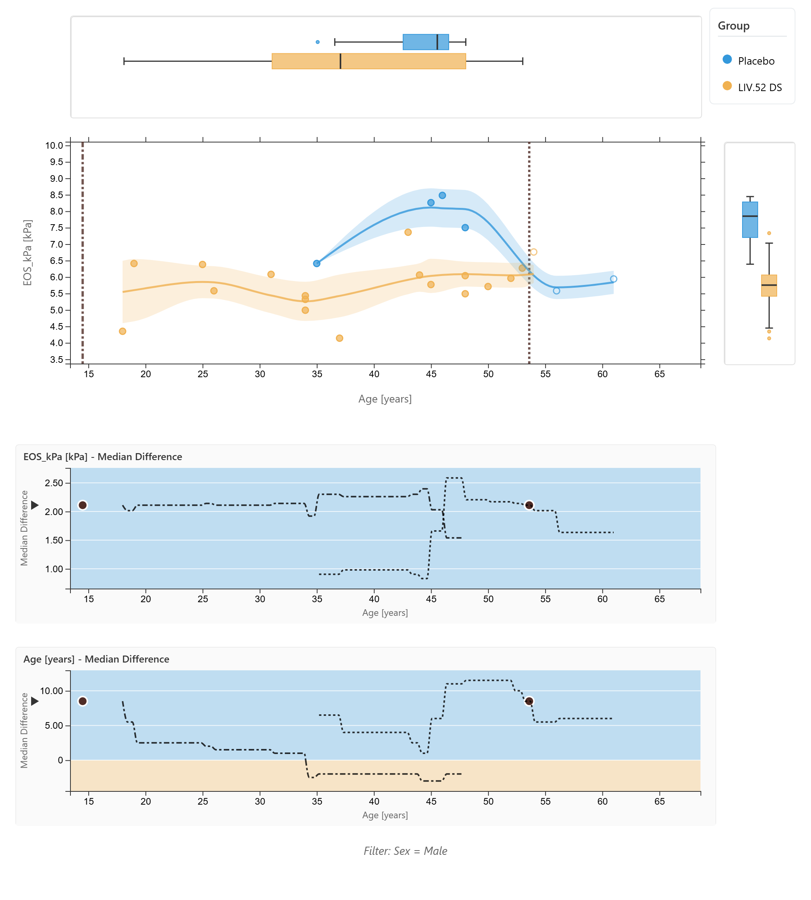
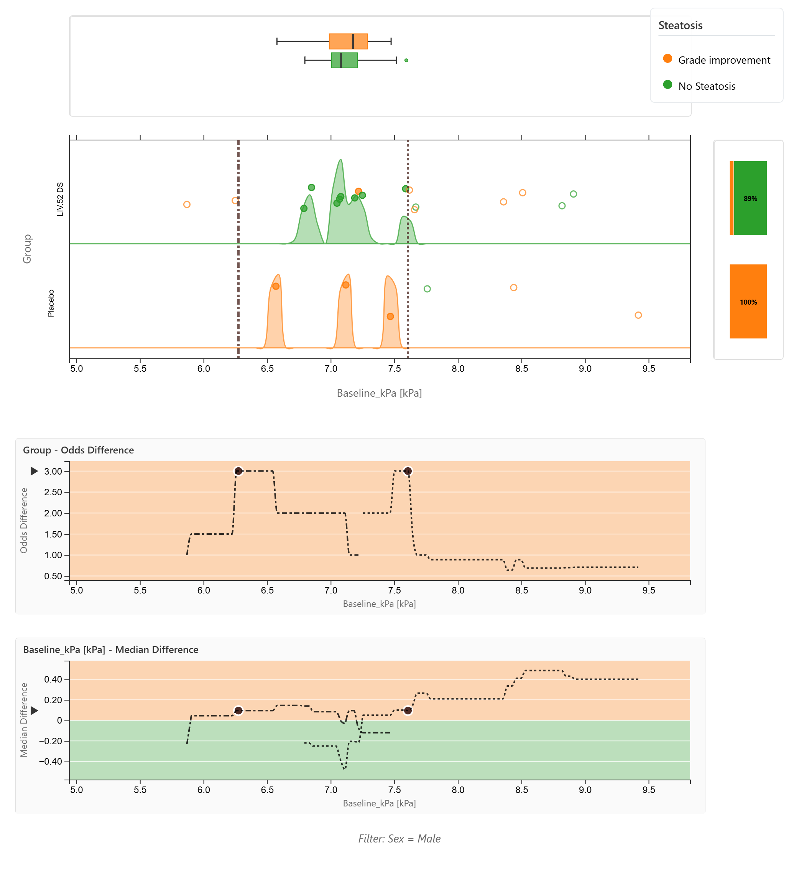
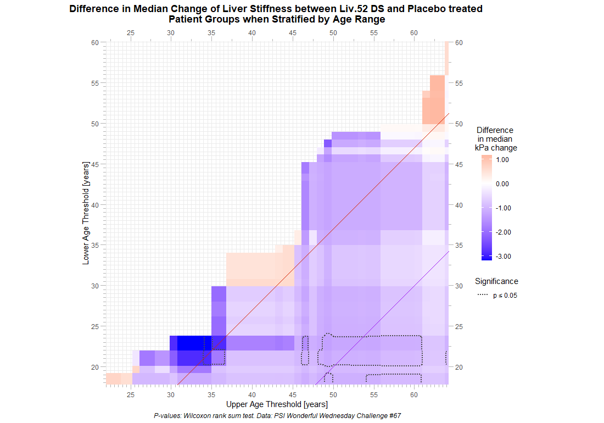
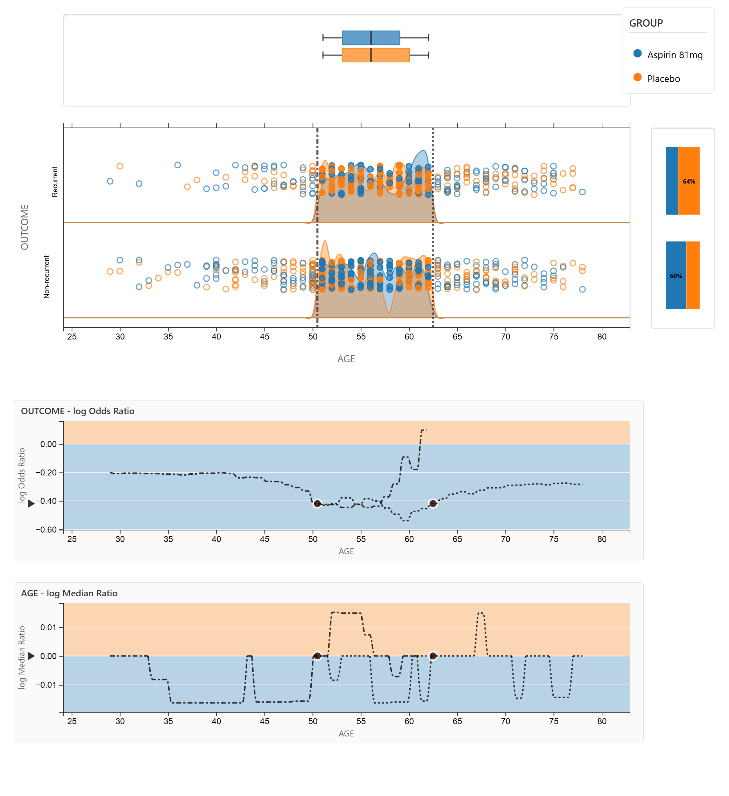
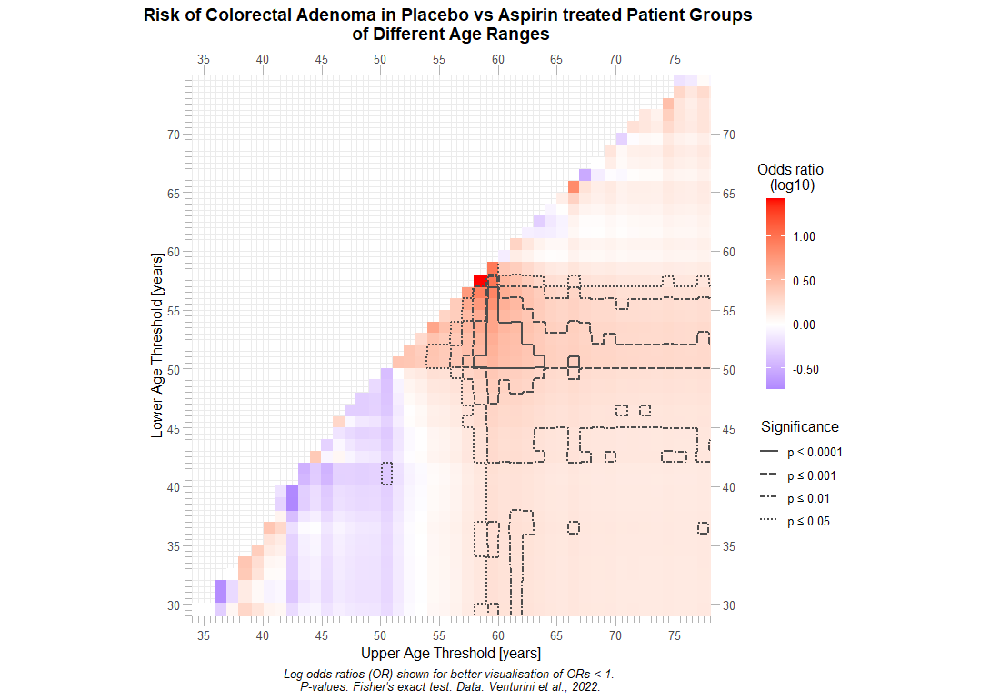
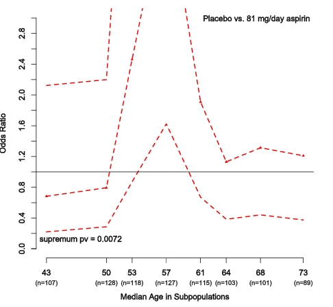
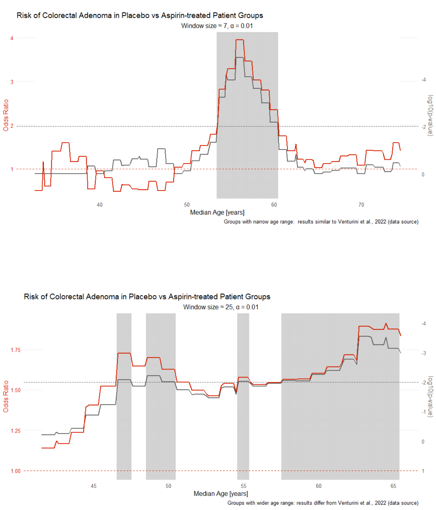

# Fatty liver disease subgroups - revisited

This challenge was posted already in September 2025. As not all proposed visualisations have been presented, there will be an additional webinar with this topic. Feel free to elaborate on the presented visuals or to propose new ones.

## The background

There is a recent publication: The Effect of Liv.52 DS in Metabolic Dysfunction-Associated Fatty Liver Disease (MAFLD): A Pilot, Randomized, Double-Blind, Placebo-Controlled, Clinical Study

The publication is available via [NIH](https://pubmed.ncbi.nlm.nih.gov/40765845/).

## The challenge

Create visualisation to explore possible differences in the treatment effect with regard to subgroups.


A description of the challenge can also be found [here](https://vis-sig.github.io/Wonderful-Wednesdays/data/2025/2025-12-10/).  
A recording of the session can be found [here](https://psiweb.org/vod/item/psi-vissig-wonderful-wednesday-70-fatty-liver-disease-subgroups---revisited). 

## Visualisation

<a id="example1"></a>

### MAFLD data explorer

  
  

  

[interactive version](1-MAFLD_explorer-ThomasW.html)

### MAFLD explorer overview

An interactive HTML dashboard for exploring clinical trial data, featuring:

- Scatter plots with adjustable X-variable minimum and maximum threshold selection
- Two analysis methods are currently implemented: Median (for numeric Y variables) and Odds (for categorical Y variables)
- Comparison plots showing median or odds differences or ratios between groups
- Real-time statistical testing
- Export capabilities for plots and statistics


**Input Data**

- Continuous variables: numerical format
- Categorical variables: character format or encoded as factors
- The dashboard auto-detects variable types and selects appropriate methods

**Analysis Methods**

- MEDIAN METHOD (Numeric Y variables):

  - Scatter plot with numeric Y-axis
  - Box plots on both axes showing distributions
  - Trend lines with LOESS smoothing and confidence intervals
  - Median Difference or Median Ratio comparison plots

- ODDS METHOD (Categorical Y variables):

  - Scatter plot with categorical Y-axis (jittered dots)
  - Density ridge plots showing distributions per category
  - Stacked bar chart showing group proportions
  - Odds Difference or Odds Ratio comparison plots
  - Binary Y comparison option for 3+ category variables


**Interactive Controls**

VARIABLE SELECTION:

- X-axis: numeric variables only
- Y-axis: numeric or categorical variables (method switches automatically)
- Colour: categorical variables for group comparison

FILTERING:

- Filter Variable dropdown: select a categorical variable to filter by
- Click filter buttons to show only selected category
- Binary comparison: pool non-selected values into "Other" group

THRESHOLD SELECTION:

- Drag dashed vertical lines on the scatter plot
- Or enter min/max values manually in the X-axis filter fields
- Data outside range shown as open circles
- Side plots update to show filtered range distributions

DISPLAY OPTIONS:

- Median method: Trend lines with adjustable LOESS bandwidth and CI toggle
- Odds method: Density ridges toggle
- Both methods: Dot size slider (0-100%)

COMPARISON TYPE:

- Difference: shows absolute difference between groups
- Ratio: shows ratio on log scale (reference line at 1)


**Statistical Tests**

for 2 Groups:

- Numeric Y: Wilcoxon Rank-Sum Test (Mann-Whitney U)
- Categorical Y: Chi-square Test

for >2 Groups:

- Numeric Y: Kruskal-Wallis Test
- Categorical Y: Chi-square Test

Results displayed for both full range and filtered range.
Significant p-values (p < 0.05) highlighted in bold green.


**Comparison Plots**

Two plots below the main scatter plot show:

- Y-variable comparison (Median or Odds difference/log ratio)
- X-variable comparison (always Median difference/log ratio)

Features:

- Curves show comparison values across threshold positions
- Dashed line: left threshold to current position
- Dash-dot line: current position to right threshold
- Tracking dots move along curves as thresholds are dragged
- Arrow indicators show current filtered range values
- Background shading indicates which group has the higher value


**Export Options**

EXPORT PLOT AS PNG:

- Saves current plot state including all visual elements
- Includes threshold positions and current selections

EXPORT SETTINGS & STATS:

- Text file with pipe-delimited format
- Includes: filters, datapoints, descriptive statistics, statistical tests
- Separate sections for full range and filtered range
- Supports both Median and Odds methods


[link to code](#example1 code)

<a id="example2"></a>

### Aspirin trial data explorer

  
  
 

 

[interactive version](5-STEPPcomparison_explorer-ThomasW.html)

## Code

<a id="example1 code"></a>

### MAFLD data explorer

```{r, echo = TRUE, eval=FALSE, code = readLines("./code/Threshold_Exploration_Dashboard_v3-Thomas_Weissensteiner.R")}

```

[Back to blog](#example1)


