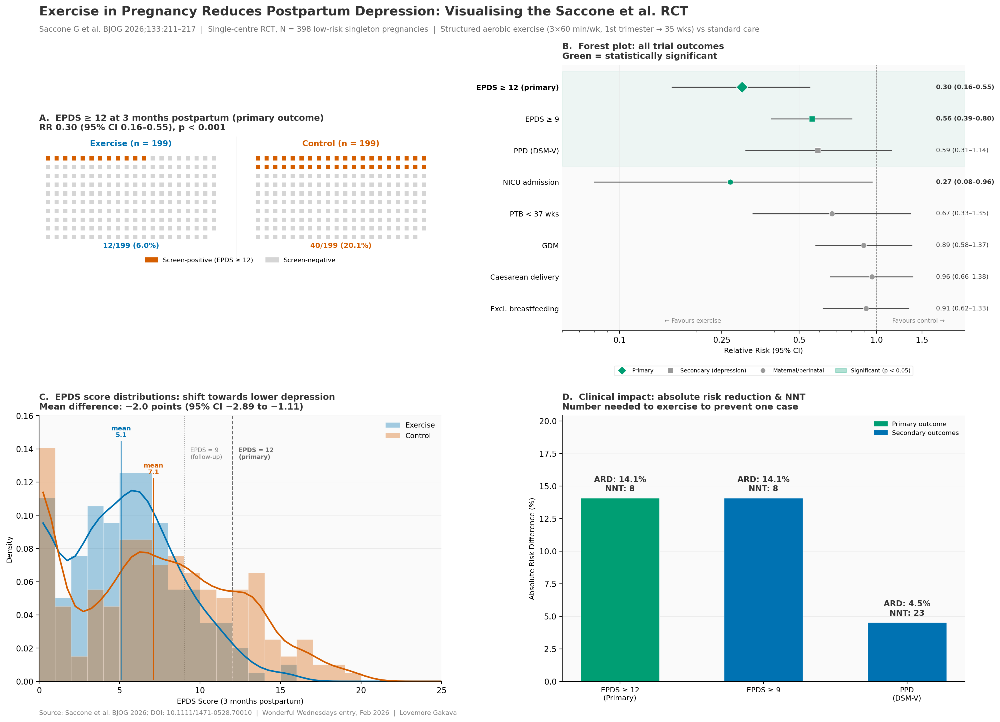

# Exercise in Pregnancy


## The background

There is a recent publication: Exercise in Pregnancy and Risk of Postpartum Depression: A Randomised Controlled Trial

The publication is available via [Wiley](https://obgyn.onlinelibrary.wiley.com/doi/10.1111/1471-0528.70010).

## The challenge

In the publication the results are presented in a table and described verbally. Create an effective visualisation to convey the positive outcome of the trial.

You may imagine being at a conference presenting the data or even presenting it in an online post or article.

A description of the challenge can also be found [here](https://vis-sig.github.io/Wonderful-Wednesdays/data/2026/2026-01-14/).  
A recording of the session can be found [here](https://psiweb.org/vod/item/psi-vissig-wonderful-wednesday-71-exercise-in-pregnancy). 

## Visualisation

<a id="example1"></a>

### Visualising the Saccone et al. RCT

  


[link to code](#example1 code)


## Code

<a id="example1 code"></a>

### 

```{r, echo = TRUE, eval=FALSE, code = readLines("./code/saccone_exercise_ppd.py")}

```

[Back to blog](#example1)


