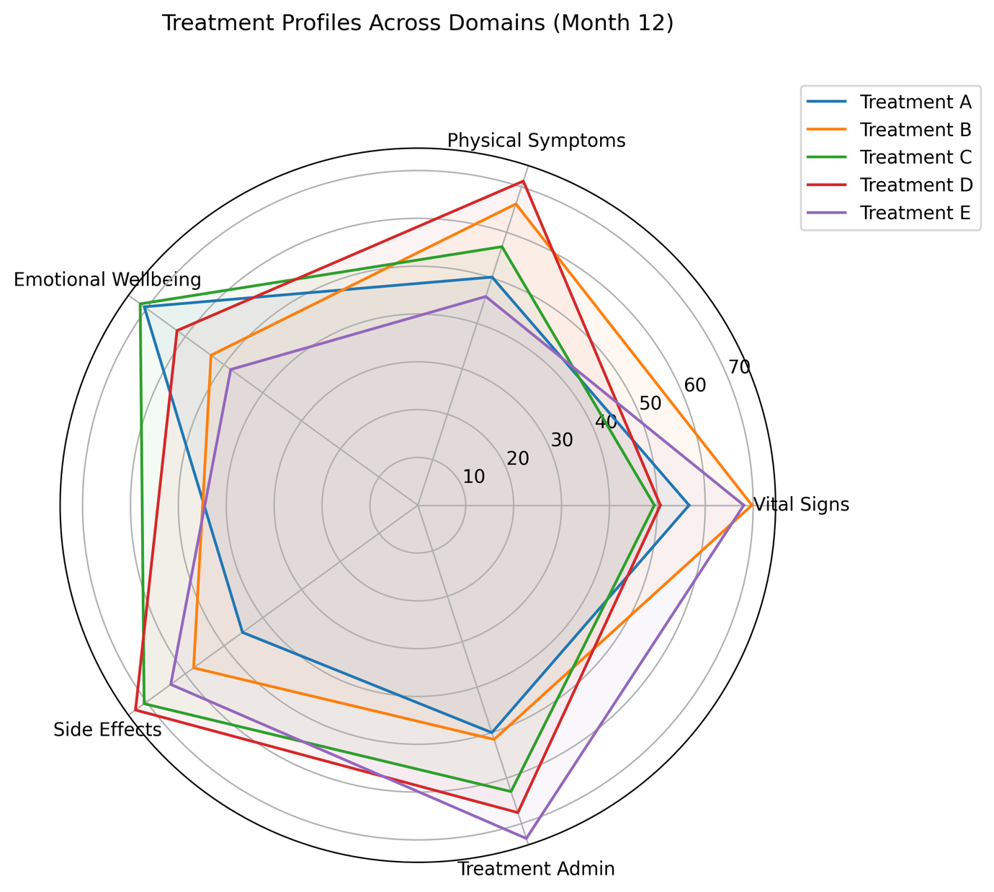
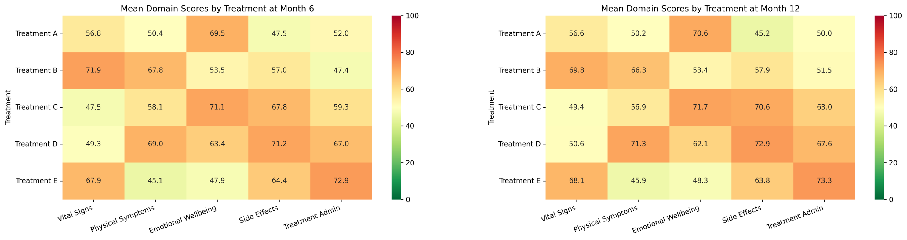
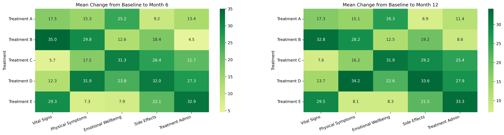
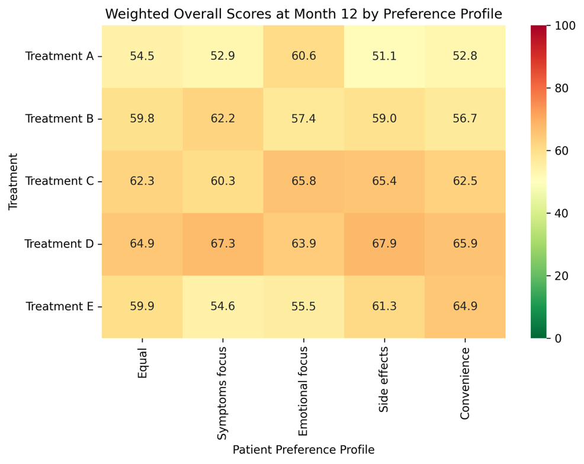
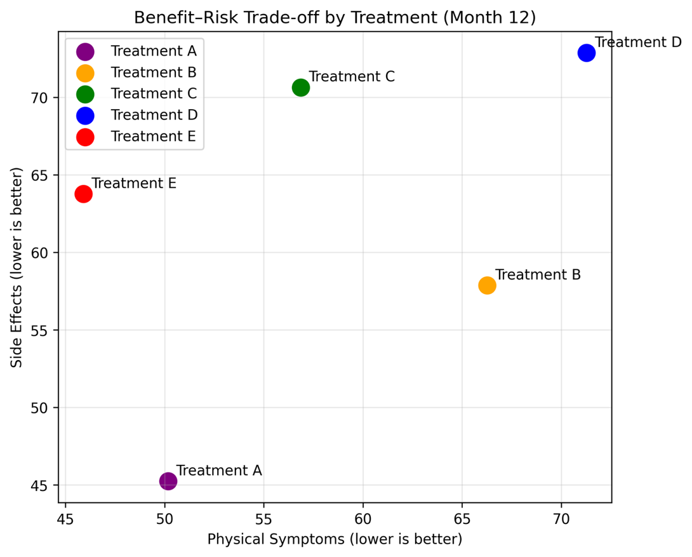
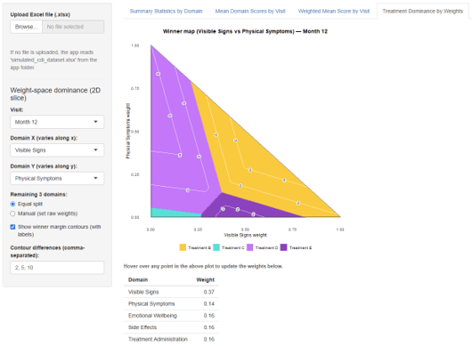

# Treatment Attributes


## The background

The current challenge considers a hypothetical measure, the “Complete Disease Index” (CDI). The measure consists of five domains, each scored on a visual analogue scale from 0-100 (0=worst possible outcome, 100=best possible outcome). The simulated data reflects a trial where 500 participants, randomized at random to one of five treatment arms, score each CDI domain at Baseline and two follow-up visits (after 6 and 12 months).

## The challenge

The challenge is to compare the relative performance of the treatments across the individual domains and overall, considering how this might change depending on the importance that subjects place on each domain.

## Visualisations

<a id="example1"></a>

### Example 1: Radar Chart

  

<a id="example2"></a>

### Example 2: Heatmaps by Domain



<a id="example3"></a>

### Example 3: Mean Change Heatmaps



<a id="example4"></a>

### Example 4: Weighted Heatmap



<a id="example5"></a>

### Example 5: Benefit-Risk Trade-Off



<a id="example6"></a>

### Example 6: Dashboard



[link to code](#example6 code)


## Code

<a id="example6 code"></a>

### Code for Dashboard

```{r, echo = TRUE, eval=FALSE, code = readLines("./code/RWA_WWW_March2026.R")}

```

[Back to blog](#example1)


