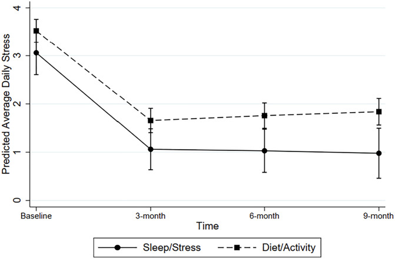
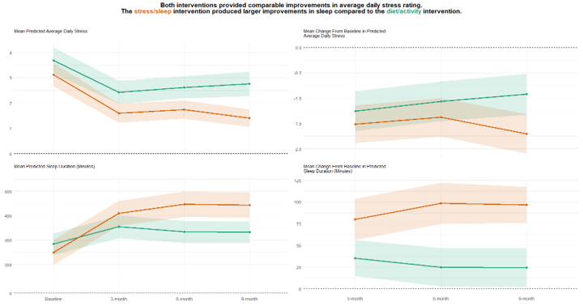
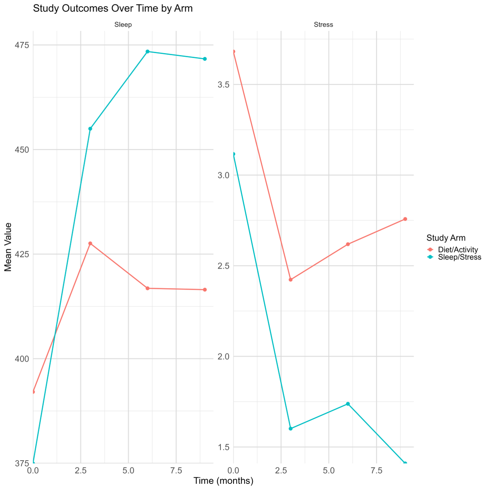
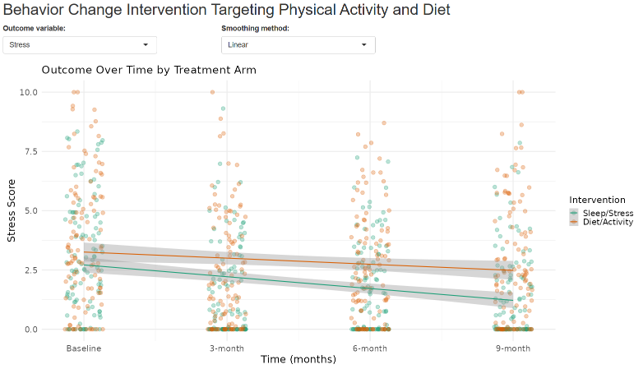

# Make Better Choices


## The background

There is a recent publication: Behavior change intervention targeting physical activity and diet improves stress and sleep.

It describes the results of the Make better choices 2 trial.

The publication is available via [PubMed](https://pubmed.ncbi.nlm.nih.gov/41770781/).

## The challenge

The challenge is to find or create a better or more suitable plot than the ones provided in the publication.

### Fig 1. Predicted average daily stress (+/-95% CI) across time as a function of intervention type
 

### Fig 2. Predicted Mean (+/-95% CI) Sleep Duration Across Time as a Function of Intervention Type
 

## Visualisations

<a id="example1"></a>

### Example 1: Static Lineplots (1)

  

[link to code](#example1 code)

<a id="example2"></a>

### Example 2: Static Lineplots (2)



<a id="example3"></a>

### Example 3: Dashboard



<a id="example4"></a>

### Example 4: Animated Lineplot


<a id="example5"></a>

### Example 5: Animated Scatter Plot


## Code

<a id="example1 code"></a>

### Code for Example 1

```{r, echo = TRUE, eval=FALSE, code = readLines("./code/RWA_WWW_April2026.R")}

```

[Back to blog](#example1)


