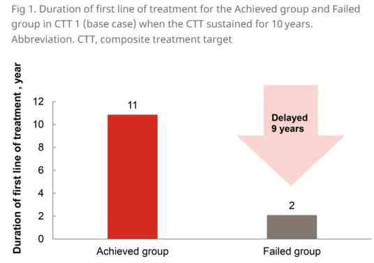
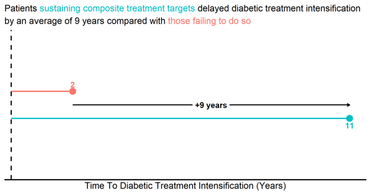
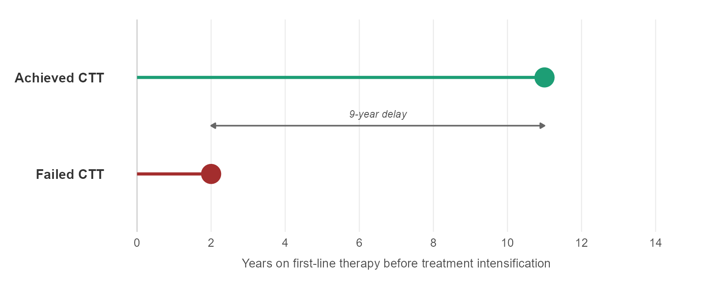
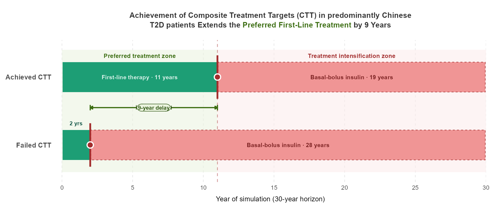
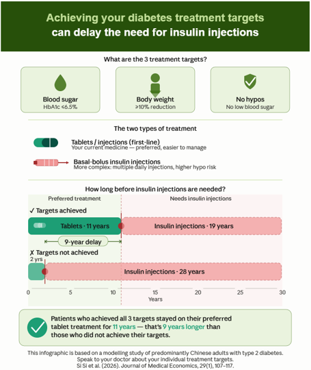
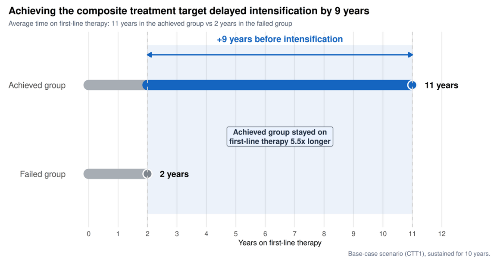

# Glycemic Control


## The background

Type 2 diabetes (T2D) is a growing health challenge in China, where many patients struggle to manage their blood sugar and weight effectively. This study looked at the long-term health and cost benefits of achieving three treatment goals: blood sugar control, weight loss, and avoiding low blood sugar episodes. Using a UK Prospective Diabetes Study Outcomes Model Version 2 (UKPDS OM2) based on patient data from a clinical trial recruiting predominantly Chinese adults with T2D, researchers found that patients who met these goals for several years had fewer diabetes-related complications, lived longer, and had better quality of life. They also saved money on healthcare costs—up to ¥53,234 per person over 30 years. The longer patients maintained these goals, the greater the benefits. These findings support the importance of achieving and maintaining treatment targets to improve health outcomes and reduce costs for people with T2D in China.

The publication is available via [Taylor and Francis](https://www.tandfonline.com/doi/full/10.1080/13696998.2025.2604454).

## The challenge

The challenge is to identify alternative design choices for the plot below to convey the main conclusion from the study results. Or to create a new plot.

 

## Visualisations

<a id="example1"></a>

### Example 1: First Draft

  

[link to code](#example1 code)

<a id="example2"></a>

### Example 2: Polished Lollipop Plot



[link to code](#example2 code)

<a id="example3"></a>

### Example 3: Treatment Timeline



[link to code](#example3 code)

<a id="example4"></a>

### Example 4: Infographic



<a id="example5"></a>

### Example 5: Timeline Difference



## Code

<a id="example1 code"></a>

### Code for Example 1

```{r, echo = TRUE, eval=FALSE, code = readLines("./code/RWA WWW May 2026.R")}

```

<a id="example2 code"></a>

### Code for Example 2

```{r, echo = TRUE, eval=FALSE, code = readLines("./code/WW 2026-05 lollipop.R")}

```

<a id="example3 code"></a>

### Code for Example 3

```{r, echo = TRUE, eval=FALSE, code = readLines("./code/WW 2026-05 treatment_timeline.R")}

```

[Back to blog](#example1)


