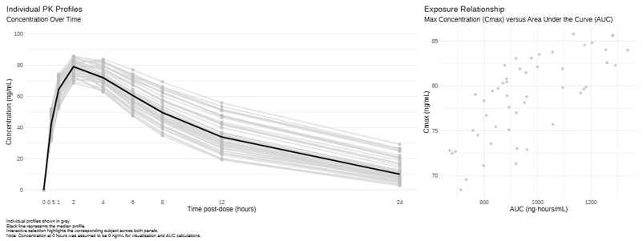
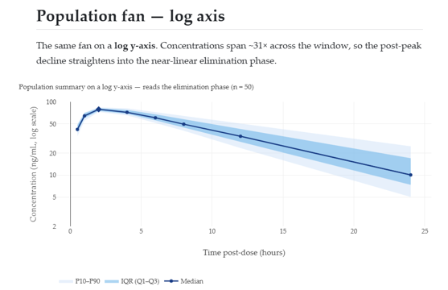
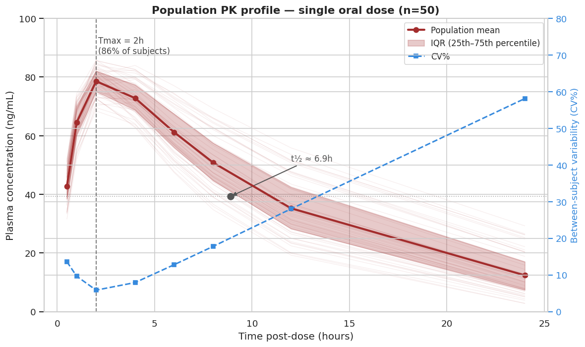

# Pharmacokinetics

## The data

This month's challenge used a simulated pharmacokinetic (PK) dataset. Each of 50 subjects received a single oral dose of an investigational drug, with plasma concentrations measured at 8 time points up to 24 hours post-dose. The dataset contained variables for subject, time post-dose and drug concentration.

## The challenge

The challenge was to use data visualisation to characterise the PK behaviour of the drug. There was no correct answer, but it was suggested that participants could explore individual PK profiles, summary trends, variability between subjects, or something else...

## Visualisations
Note: Submissions 1 and 2 both contain interactivity. Hence, they are best explored via the HTML files.

<a id="example1"></a>

### Submission 1: Connected Interactive Plots

 

View the HTML file: [Connected Interactive Plots](./interactive_pk_visualisation.html)

[link to code](#example1 code) 


<a id="example2"></a>

### Submission 2: Scroll Storytelling

 
View the HTML file: [Scroll Storytelling](./pk_scroll_story.html)

[link to code](#example2 code) 

### Submission 3: Heatmap

 

### Submission 4: Population Profile

 

## Code

<a id="example1 code"></a>

### Code for Submission 1

```{r, echo = TRUE, eval=FALSE, code = readLines("./code/RWA_WWW_July2026.R")}

```

<a id="example2 code"></a>

### Code for Submission 2

```{r, echo = TRUE, eval=FALSE, code = readLines("./code/pk_scroll_story.qmd")}

```

[Back to blog](#example1)